Consistent Lua/SQL types
========================

-   **Status**: In progress
-   **Start date**: 01-2021
-   **Authors**: Timur Safin <tsafin@tarantool.org>
-   **Co-Authors**: Peter Gulutzan, Igor Munkin, Mergen Imeev
-   **Issues**:  #5847, #5818, #5148, #4470, #5852,
-   **Epic**: #5817

## Changes


-   v2 - this version, updated with discussion details;
-   v1 - https://github.com/tarantool/tarantool/discussions/5910 - original discussion


Table of Content
----------------
- [Consistent Lua/SQL types](#consistent-luasql-types)
  - [Changes](#changes)
  - [Table of Content](#table-of-content)
- [Introduction](#introduction)
- [Lua types](#lua-types)
  - [LuaJIT types](#luajit-types)
  - [Lua vs LuaJIT types](#lua-vs-luajit-types)
- [Box format field types](#box-format-field-types)
- [Messagepack types aka mp-types](#messagepack-types-aka-mp-types)
  - [Messagepack types supported by format field types](#messagepack-types-supported-by-format-field-types)
  - [MessagePack serialization issues](#messagepack-serialization-issues)
- [SQL types](#sql-types)
  - [(SQLite) Mem-types](#sqlite-mem-types)
- [Missing SQL types](#missing-sql-types)
  - [DECIMAL SQL type](#decimal-sql-type)
  - [Date, time and timestamps](#date-time-and-timestamps)
  - [UUIDs](#uuids)
  - [Array](#array)
  - [Map](#map)
  - [BIT](#bit)
  - [XML](#xml)
  - [JSON](#json)
- [SQL conversion rules](#sql-conversion-rules)
  - [Comparison operators](#comparison-operators)
  - [SCALAR conversion issues](#scalar-conversion-issues)
  - [Implicit casts](#implicit-casts)
  - [Explicit casts](#explicit-casts)

# Introduction

The purpose of this paper is to try to create a clear and
non-contradicting description of a typing model, which covers both
worlds of types in NoSQL Lua (Tarantool box), and in SQL. Wherever
possible we will try to commonize types used, and, if that's not
possible, we will try to present least harmful conversion rules.

If a conversion rule is not straightforward and should employ any logic,
this should be the least surprising logic.

The problem is (as usual) in details. Despite the fact that all parties
involved have very similar type system - be it Lua, Tarantool storage
engines (with format schema applied to spaces), MessagePack used as
internal serialization format, or SQL engine (heavily influenced by
SQLite design). In all those cases we could find subtle, but important
differences here and there.

*The goal of the current specification is to define direction to either
minimize those differences or to get rid of them altogether.*

As an example, if we look into Tarantool storage then today Tarantool
box uses two different categories of types:

-   *Field types* as described by format (if it's applied to the space);
-   and serialization types used by messagepack also known as  *mp-types.*

In the longer term, we should get to the situation when SQL type system
described in the terms of Tarantool field-types. At the moment there are
conversion rules but we want to eliminate their use so there is no
information loss.

# Lua types

The Lua type system is a major part of Tarantool's data type system.
It's worth noting that it's important to remember that Lua is a
*dynamically typed language* with its own type
[coercion rules](https://www.lua.org/manual/5.1/manual.html#2.2.1)
and [data values limitations](https://www.lua.org/manual/5.1/manual.html#2.2).
Furthermore, [LuaJIT FFI library](http://luajit.org/ext_ffi_semantics.html)
provides the mechanism for implementing custom types. Everything
mentioned above should be taken into account during data processing
in both box and SQL.

As it's written in the
[Lua 5.1 Reference Manual](https://www.lua.org/manual/5.1/manual.html#2.2):
> There are eight basic types in Lua: *nil*, *boolean*, *number*,
> *string*, *function*, *userdata*, *thread*, and *table*. *Nil* is the
> type of the value **nil**, whose main property is to be different from
> any other value; it usually represents the absence of a useful value.
> *Boolean* is the type of the values **false** and **true**. <...>
> *Number* represents real (double-precision floating-point) numbers.
> <...> *String* represents arrays of characters.

LuaJIT extends the list of built-in datatypes with the cdata type, with
which one can implement an arbitrary custom data type via FFI (e.g.
unsigned long 64-bit integer uint64\_t).

Here is the list of basic data types we have in the Lua/LuaJIT virtual
machines. Highlighted are additional types introduced by LuaJIT for its
own purposes.

| ***Type name constant*** |        | ***Human-readable name*** | ***Example***                                                                               |
|--------------------------|--------|---------------------------|---------------------------------------------------------------------------------------------|
| LUA\_TNIL                | 0      | nil                       | nil                                                                                         |
| LUA\_TBOOLEAN            | 1      | boolean                   | true, false                                                                                 |
| LUA\_TLIGHTUSERDATA      | 2      | userdata                  | [`lua_pushlightuserdata`](https://www.lua.org/manual/5.1/manual.html#lua_pushlightuserdata) |
| LUA\_TNUMBER             | 3      | number                    | 3.14                                                                                        |
| LUA\_TSTRING             | 4      | string                    | "string"                                                                                    |
| LUA\_TTABLE              | 5      | table                     | {}                                                                                          |
| LUA\_TFUNCTION           | 6      | function                  | function() end                                                                              |
| LUA\_TUSERDATA           | 7      | userdata                  | io.stdout                                                                                   |
| LUA\_TTHREAD             | 8      | thread                    | coroutine.create(function() end))                                                           |
| **LUA\_TPROTO**          | **9**  |                           |                                                                                             |
| **LUA\_TCDATA**          | **10** |                           | 1ULL                                                                                        |


**NB!** There is no values of LUA\_TPROTO and LUA\_TCDATA types yielded
via public Lua C API as them are purely internal.

*Remember, in a longer run we want to have the least destructive
conversion rules while transferring data from Lua world to box storage
world to SQL world.*

## LuaJIT types

LuaJIT internally uses a little bit different set of types than those of
Lua. That was done mostly for performance reasons, as a dirty hack to
squeeze everything to local variables of 8 byte size.

| ***Type name constant*** |         | ***Human-readable name*** | ***Example***                                                                               |
|--------------------------|---------|---------------------------|---------------------------------------------------------------------------------------------|
| LJ\_TNIL                 | (\~0u)  | nil                       | nil                                                                                         |
| LJ\_TFALSE               | (\~1u)  | boolean                   | false                                                                                       |
| LJ\_TTRUE                | (\~2u)  | boolean                   | true                                                                                        |
| LJ\_TLIGHTUD             | (\~3u)  | userdata                  | [`lua_pushlightuserdata`](https://www.lua.org/manual/5.1/manual.html#lua_pushlightuserdata) |
| LJ\_TSTR                 | (\~4u)  | string                    | "string"                                                                                    |
| LJ\_TUPVAL               | (\~5u)  | upval                     |                                                                                             |
| LJ\_TTHREAD              | (\~6u)  | thread                    | coroutine.create(function() end))                                                           |
| LJ\_TPROTO               | (\~7u)  | proto                     |                                                                                             |
| LJ\_TFUNC                | (\~8u)  | function                  | function() end                                                                              |
| LJ\_TTRACE               | (\~9u)  | trace                     |                                                                                             |
| LJ\_TCDATA               | (\~10u) | cdata                     | 1ULL                                                                                        |
| LJ\_TTAB                 | (\~11u) | table                     | {}                                                                                          |
| LJ\_TUDATA               | (\~12u) | userdata                  | io.stdout                                                                                   |
| LJ\_TNUMX                | (\~13u) | number                    | 3.14                                                                                        |


From the user perspective these types are not extending the list of
supported types presented in the Lua types table above, and not
modifying (extending or contracting) our mental type schema anyway. So,
we put it here mostly for illustrative reasons.

## Lua vs LuaJIT types


There is strict correspondence between internal LuaJIT types and
original Lua types

|     |                     |                                                                                             |              |         |                |
|-----|---------------------|---------------------------------------------------------------------------------------------|--------------|---------|----------------|
| 0   | LUA\_TNIL           | nil                                                                                         | LJ\_TNIL     | (\~0u)  | nil            |
| 1   | LUA\_TBOOLEAN       | false                                                                                       | LJ\_TFALSE   | (\~1u)  | boolean        |
| 1   | LUA\_TBOOLEAN       | true                                                                                        | LJ\_TTRUE    | (\~2u)  | boolean        |
| 2   | LUA\_TLIGHTUSERDATA | [`lua_pushlightuserdata`](https://www.lua.org/manual/5.1/manual.html#lua_pushlightuserdata) | LJ\_TLIGHTUD | (\~3u)  | light userdata |
| 4   | LUA\_TSTRING        | "string"                                                                                    | LJ\_TSTR     | (\~4u)  | string         |
|     |                     |                                                                                             | LJ\_TUPVAL   | (\~5u)  | upval          |
| 8   | LUA\_TTHREAD        | coroutine.create(function() end))                                                           | LJ\_TTHREAD  | (\~6u)  | thread         |
| 9   | LUA\_TPROTO         |                                                                                             | LJ\_TPROTO   | (\~7u)  | proto          |
| 6   | LUA\_TFUNCTION      | function() end                                                                              | LJ\_TFUNC    | (\~8u)  | function       |
|     |                     |                                                                                             | LJ\_TTRACE   | (\~9u)  | trace          |
| 10  | LUA\_TCDATA         | 1ULL                                                                                        | LJ\_TCDATA   | (\~10u) | cdata          |
| 5   | LUA\_TTABLE         | {}                                                                                          | LJ\_TTAB     | (\~11u) | table          |
| 7   | LUA\_TUSERDATA      | io.stdout                                                                                   | LJ\_TUDATA   | (\~12u) | userdata       |
| 3   | LUA\_TNUMBER        | 3.14                                                                                        | LJ\_TNUMX    | (\~13u) | number         |


But from user perspective those differences are invisible and
inaccessible, thus for the purposes of current specification, while
talking about Lua types we will always be referring to LUA\_\* types,
not LJ\_\* types.

### Issues with box.NULL and nil

> Citing our documentation "Is a NULL in SQL the same thing as a nil in
> Lua? No, but it is close enough that there will be confusion. When nil
> means .unknown. or .inapplicable., yes. But when nil means .nonexistent.
> or .type is nil., no. NULL is a value, it has a data type because it is
> inside a column which is defined with that data type."

There is one inherent, nasty problem - this is how box.NULL values are
handled in Lua expressions. Despite the fact the behaviour follows the
[described semantics](http://luajit.org/ext_ffi_semantics.html#cdata_comp),
this looks very confusing.

```
tarantool> nil == box.NULL
---
- true
...
tarantool> if nil then print 'truthy' else print 'falsy' end
falsy
---
...
tarantool> if box.NULL then print 'truthy' else print 'falsy' end
truthy
---
...
```

This is the place where LuaJIT violates Lua reference manual: as it's
mentioned above the main property of nil is being different from any other
value. At the same time one can see it's not in LuaJIT with FFI enabled.
Anyway, it's worth to explicitly mention that the
[issue](https://github.com/tarantool/tarantool/discussions/4227)
won't be fixed.

# Box format field types

Historically, in Tarantool, as a NoSQL database, programmer could work
with space data even without schema/format provided. In this case, data
to be serialized was stored with
[MessagePack](https://github.com/msgpack/msgpack/blob/master/spec.md)
format, which acts on received data *values*, and saves them in the most
compact form possible.

Space schemas, known as formats, have been introduced to Tarantool after
version 1.7.* and have been used for validation of data being inserted
to the data store. SQL could not work unless a format is provided, thus
we assume such a precondition from now on - each space should have
format assigned to it.

There is a space:format() method which might be used to define a field
constraints which we enforce on data when storing to the database.

<https://www.tarantool.io/en/doc/latest/reference/reference_lua/box_space/format/>

At the moment of writing, we have this list of supported field types:

|                         |       |           |
|-------------------------|-------|-----------|
|  FIELD\_TYPE\_ANY       | 0     | any       |
|  FIELD\_TYPE\_UNSIGNED  | 1     | unsigned  |
|  FIELD\_TYPE\_STRING    | 2     | string    |
|  FIELD\_TYPE\_NUMBER    | 3     | number    |
|  FIELD\_TYPE\_DOUBLE    | 4     | double    |
|  FIELD\_TYPE\_INTEGER   | 5     | integer   |
|  FIELD\_TYPE\_BOOLEAN   | 6     | boolean   |
|  FIELD\_TYPE\_VARBINARY | 7     | varbinary |
|  FIELD\_TYPE\_SCALAR    | 8     | scalar    |
|  FIELD\_TYPE\_DECIMAL   | 9     | decimal   |
|  FIELD\_TYPE\_UUID      | 10    | uuid      |
|  FIELD\_TYPE\_ARRAY     | 11    | array     |
|  FIELD\_TYPE\_MAP       | 12    | map       |

An additional "is\_nullable" attribute in the format or index definition
allows saving nil values in data tuples.

If we compare the list of Lua types to the list of format field types we
could easily recognize differences and omissions on both sides. Number
in Lua could easily end up as any, scalar, number, unsigned, integer or
double in box:format. There is no direct translation to Lua for fields
of scalar types. There are neither primitive type for uuid, nor decimal
type in Lua.

These incompatibilities are not that much of a problem because we rely
on programmers themselves to decide when it's necessary select which Lua
values to save to which field. But there are some subtle current
limitations which we want to fix in the longer run, but more on them
after the messagepack introduction.

# Messagepack types aka mp-types

Mp-types used in the Tarantool core are a set of standard MessagePack
types plus a set of extended types introduced for Tarantool purposes via
the MP\_EXT extension mechanism.

| **Basic mp-types** | **Extended mp-types**      |
|--------------------|----------------------------|
|     MP\_NIL        |     MP\_UNKNOWN\_EXTENSION |
|     MP\_UINT       |     MP\_DECIMAL            |
|     MP\_INT        |     MP\_UUID               |
|     MP\_STR        |     MP\_ERROR              |
|     MP\_BIN        |                            |
|     MP\_ARRAY      |                            |
|     MP\_MAP        |                            |
|     MP\_BOOL       |                            |
|     MP\_FLOAT      |                            |
|     MP\_DOUBLE     |                            |
|     MP\_EXT        |                            |

Only two of the four extended types are user visible, and have any
relation whatsoever to the scope of this this paper (MP\_DECIMAL,
MP\_UUID), so we leave out the other ones as out-of-scope.

## Messagepack types supported by format field types


**Acceptance table extracted from code** (click to expand)

Acceptance table for messagepack data saved into filed type columns as
defined in conversion tables named
`field_mp_type[]/field_ext_type[]` from `src/box/field_def.c#58`)

|                        |                                                                              |
|------------------------|------------------------------------------------------------------------------|
| FIELD\_TYPE\_ANY       | mp-type \\ {MP\_UNKNOWN\_EXTENSION}                                          |
| FIELD\_TYPE\_UNSIGNED  | {MP\_NIL, **MP\_UINT**}                                                      |
| FIELD\_TYPE\_STRING    | {MP\_NIL, **MP\_STR**}                                                       |
| FIELD\_TYPE\_NUMBER    | {MP\_NIL, **MP\_UINT, MP\_INT, MP\_FLOAT, MP\_DOUBLE, MP\_DECIMAL**}         |
| FIELD\_TYPE\_DOUBLE    | {MP\_NIL, **MP\_DOUBLE**}                                                    |
| FIELD\_TYPE\_INTEGER   | {MP\_NIL, **MP\_UINT, MP\_INT**}                                             |
| FIELD\_TYPE\_BOOLEAN   | {MP\_NIL, **MP\_BOOL**}                                                      |
| FIELD\_TYPE\_VARBINARY | {MP\_NIL, **MP\_BIN**}                                                       |
| FIELD\_TYPE\_SCALAR    | {MP\_NIL, **MP\_UINT, MP\_INT, MP\_FLOAT, MP\_DOUBLE, MP\_DECIMAL, MP\_STR, MP\_BIN, MP\_BOOL**} |
| FIELD\_TYPE\_DECIMAL   | {MP\_NIL, **MP\_DECIMAL**}                                                   |
| FIELD\_TYPE\_UUID      | {MP\_NIL, **MP\_UUID**}                                                      |
| FIELD\_TYPE\_ARRAY     | {MP\_NIL, **MP\_ARRAY**}                                                     |
| FIELD\_TYPE\_MAP       | {MP\_NIL, **MP\_MAP**}                                                       |

i.e. for example, we see that the `FIELD_TYPE_NUMBER` column could
accept as valid values data which is represented as `MP_UINT` (unsigned
positive values or 0), `MP_INT` (negative values), `MP_FLOAT`/`MP_DOUBLE`
(floating values) and `MP_DECIMAL` (extended MP type introduced in
Tarantool for decimal values support).

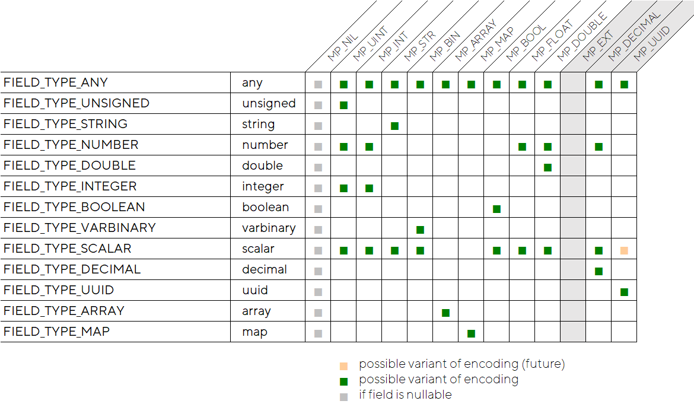

## MessagePack serialization issues

### Serialization of floating values

The table above looks reasonable at first sight, but due to the way we
serialize tables to MessagePack without consideration of space format
specifications, and only using incoming Lua values, we might get to the
case when Lua box behaves differently from SQL:

```
tarantool> \set language sql
---
- true
...
tarantool> create table t1(a1 double primary key)
---
- row_count: 1
...
tarantool> insert into t1 values(423.0)
---
- row_count: 1
...
tarantool> insert into t1 values(423.13)
---
- row_count: 1
...

tarantool> \set language lua
---
- true
...
tarantool> box.space.T1:insert({424.13})
---
- [424.13]
...
tarantool> box.space.T1:insert({424.0})
---
- error: 'Tuple field 1 type does not match one required by operation:
expected double'
...
tarantool> ffi = require 'ffi'
---
...
tarantool> box.space.T1:insert({ffi.cast('double', 424.0)})
---
- [424]
...
```

Here is the problem, as it seems today:

-   We create a Lua table {424.0} with a single entry of number type;

-   Inside of box\_insert, the tuple we passed is being serialized to
    MessagePack array using a generic approach, and a normalized number
    424 is serialized as MP\_UINT (unsigned positive int);

-   But, later on unsigned integer is not accepted according to the
    space schema, which is expecting double here. The only dirty
    work-around today, which would allow to save such normalized
    doubles, is to use ffi.cast('double', value) which could enforce
    double value in table, but which is quite ugly and may be unexpected
    by customers.


#### Proposed Solution

We believe, that *space, which does have schema attached,* should not
proceed with a *generic* MessagePack serialization routine using the
*value-based approach*, but rather ought to use a type-based algorithm
according to the space's format. This format type would be a hint for
selection of the MP\_\* type encoding schema necessary for the field.

### Serialization of nil and box.NULL

Looking from a brighter side we should say that simple nil and box.NULL,
once passed to msgpuck module or saved to storage, they are stored
similarly:

```
tarantool> mp = require 'msgpack'
---
...
tarantool> mp.encode({box.NULL,2})
---
- !!binary ksAC
...
tarantool> mp.encode({nil,2})
---
- !!binary ksAC
...
```


# SQL types


The following type names are specified by ISO SQL: bigint, binary,
binary varying, boolean, char, character varying, character, varchar,
date, double precision, integer, interval, numeric, decimal, real,
smallint, time (with or without time zone), timestamp (with or without
time zone), xml.

*FYI: Despite the fact that SQL:2016 has added JSON support, it was not
done in a way that was similar to XML support, and there is no currently
added json data type for that.*

Speaking of SQL types in Tarantool we may distinguish their original,
syntactic form in the SQL dialect used in Tarantool, and their internal
representation form also known as "mem-types".

In the ideal world mem-types would be equivalent to a Tarantool engine's
field types, but that's not the case at the moment, so some conversions
should be applied. In the longer term we have to take several steps to
commonize those types, reducing any possible conversion overhead.

Let us compare space field types, SQL types, and MEM-types:

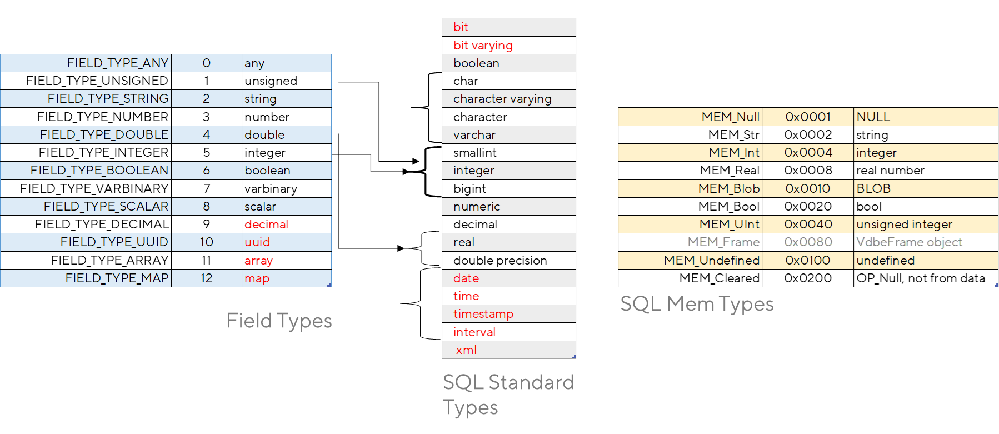

\[To the left we see box type systems, in the middle are standard ISO
SQL types, and to the right we see SQL MEM-types\]

If we compare the list of supported box types with standard SQL types
(with their underlying mem-types) then we could see multiple omissions
on all sides involved.

For example, now there is no DECIMAL type in Tarantool SQL, but there is
decimal support in box. The same problem exists for UUID, MAP, or ARRAY
types. (But less so for map and array, because they are supported
partially, to some degree).

## (SQLite) Mem-types


At the moment of writing Tarantool SQL engine uses a different type
system inside of its VDBE routines, those names could be recognized by
their MEM\_ prefix. This type system resembles very much the type system
used by box, but is rather encoded differently.

|                |        |                           |
|----------------|--------|---------------------------|
| MEM\_Null      | 0x0001 | NULL                      |
| MEM\_Str       | 0x0002 | String                    |
| MEM\_Int       | 0x0004 | Signed (negative) Integer |
| MEM\_Real      | 0x0008 | real number               |
| MEM\_Blob      | 0x0010 | BLOB                      |
| MEM\_Bool      | 0x0020 | Bool                      |
| MEM\_UInt      | 0x0040 | unsigned integer          |
| MEM\_Frame     | 0x0080 | VdbeFrame object          |
| MEM\_Undefined | 0x0100 | Invalidated               |
| MEM\_Cleared   | 0x0200 | OP\_Null, not from data   |

MEM\_Str / MEM\_Blob could have various modifiers, allocator related and
garbage collection related (e.g. MEM\_Dyn, MEM\_Static, or MEM\_Ephem),
but we will leave them out-of-scope for the current document
MEM\_-types are directly translatable to MessagePack types, their
current difference is that they are bit masks, and could encode
different subtypes at the same moment:

|             |                                                                                  |
|-------------|----------------------------------------------------------------------------------|
|  MP\_NIL    | MEM\_Null                                                                        |
|  MP\_UINT   | MEM\_UInt                                                                        |
|  MP\_INT    | MEM\_INT                                                                         |
|  MP\_STR    | MEM\_STR                                                                         |
|  MP\_BIN    | MEM\_Blob & {there is no subtype flag }                                          |
|  MP\_ARRAY  | MEM\_Blob & {there is a subtype flag and the mp\_typeof() of value is MP\_ARRAY} |
|  MP\_MAP    | MEM\_Blob & { there is a subtype flag and the mp\_typeof() of value is MP\_MAP}  |
|  MP\_BOOL   | MEM\_Bool                                                                        |
|  MP\_DOUBLE | MEM\_Real                                                                        |

At the moment there is an effort
[\#5818](https://github.com/tarantool/tarantool/issues/5818) to
centralize mem-types code, and extract all getters/setters to a common
place. The intention is - have the ability eventually to switch to the
same type system as box, avoiding any extra conversion overhead.

### SQL NULL and Lua nil(s)


Fortunately, SQL NULL is unambiguously equal to nil and box.NULL if used
for binding arguments:

```
tarantool> box.execute [[ create table t4(t1 int primary key, f1 int null) ]]
...
tarantool> box.execute('insert into t4 values (?, ?)', {2, nil})
...
tarantool> box.execute('insert into t4 values (?, ?)', {3, box.NULL})
...
tarantool> box.execute('insert into t4 values (4, NULL)')
...
tarantool> box.execute [[ select * from t4 ]]
---
- metadata:
- name: T1
type: integer
- name: F1
type: integer
rows:
- [2, null]
- [3, null]
- [4, null]
```

One could say that there is another NULL discrepancy in box vs SQL, e.g.

```
tarantool> box.space.nullable.index.sec:select{ box.NULL }
---
- [2, null]
- [3, null]
...
tarantool> box.execute[[ select * from "nullable" where "test" = NULL ]]
---
- metadata:
- name: id
type: integer
- name: test
type: integer
rows: []
...
```

*But this works **as expected** - there is no way in SQL to compare
(using '=') NULL against anything, including NULL itself. If you really
need to find null values in SQL then you have to use "IS \[NOT\] NULL"
predicate, not an equality operator '='.

### '00000000-0000-0000-0000-000000000000' and SQL NULL

There is yet another discrepancy which we would rather not fix between
Lua and SQL worlds -- treatment as nil/NULL of the special UUID value
'00000000-0000-0000-0000-000000000000'. In Lua we would consider it as
nil (for some odd reason):

```
tarantool> uuid.fromstr('00000000-0000-0000-0000-000000000000'):isnil()
---
- true
...
```

While in SQL the similar expression should be false for the
`CAST('00000000-0000-0000-0000-000000000000' AS UUID) IS NULL`
predicate. We see not much point in extending the IS NULL predicate with
predefined "nil UUIDs" semantics. SQL NULL is SQL NULL. If we need to
check for "nil UUIDs" we could introduce a new built-in like
`uuid_is_null(x)`.


### BLOBs issues - '\\0' problem in SQL


At the moment, both blobs and strings might add a terminating \\0 byte
to their allocated chunks inside of the Tarantool SQL engine. We
believe, that this approach for blob is unnecessary and counter
intuitive. We should make sure that there is no post-processing for raw
blobs, and they are passed as-is, without any extra conversion or
massaging.

### BLOBs issues - blobs in Lua

Inserting blobs via Lua is not a very easy task. There are some known
dirty voodoo tricks which you need to proceed to insert binary values
into tuple fields from the Lua side - see [\#1629
(comment)](https://github.com/tarantool/tarantool/issues/1629#issuecomment-422399614)
, but this recipe is a mouthful and troublesome.

*For consistency's sake, the easy task in SQL should be similarly easy
as in box*. We need to introduce an api or some extra convention to pass
unmodified binary data to blob fields.

The current hypothesis is - this problem might be fixed and code greatly
simplified once we start to use space format for MessagePack
serialization (see MessagePack serialization issues)


# Missing SQL types

There are several data types, which are already available in box, but
have still not been exported via SQL, e.g.:

-   Decimal
-   UUID
-   Array
-   Map

Also there are big set of SQL standard types which are missing both sides
(in box and in Tarantool SQL):

-   Date/Time/Timestamp/Interval

We will cover inconsistency here using different approaches:

-   As a simplest way, we may provide a set of built-in functions
    operating with some underlying data types, which may provide a
    simple interface to access and manipulate these values without major
    extensions in the SQL syntax parser;

-   In the longer term, we may bring full functionality to syntax, while
    bringing a wider set of built-in functions, based upon other
    vendors' current practices.

-   It is worth highlighting that, *if we add anything to SQL*, due to
    current standard demands, and if *there is no Lua support* (yet) for
    similar functionality, then we need to create corresponding methods
    to provide similar functions in the Lua world, either via built-in
    modules, or via external Luarock implementation).

*At the end of current efforts, we are supposed to provide a consistent
picture for Lua and SQL, having them as much compatible as possible.*

## DECIMAL SQL type

DECIMAL is not yet supported in Tarantool SQL, while it is already
supported in box. To make this consistent we would like to follow this
plan:

1.  Make decimal available as SQL primary type in table declarations,
    without yet modifying the set of implicit/explicit conversion rules,
    i.e. no conversion possible yet;

2.  Include it to a (non-standard) NUMBER data type in Tarantool SQL,
    which is a superset of the integer and floating types. When the
    DECIMAL type is added, Tarantool SQL, the NUMBER should be a
    superset of DECIMAL as well.

3.  Add a set of built-in functions, which would allow operating on the
    DECIMAL type.

4.  Add *explicit cast* for the necessary cases as a special part of
    built-in functions;

5.  Then modify the *implicit cast* rules for constant expressions and
    for runtime coercion;

DECIMAL is an exact numeric type according to SQL standard definitions.
Depending on the SQL vendor implementation, integer literals may
actually have subtypes of DECIMAL type.

### Example: MS SQL-Server DECIMAL rules

For example, in MS SQL-Server DECIMAL and NUMERIC are equivalent:

> **decimal**\[ (p\[ ,s\] )\] and **numeric**\[ (p\[ ,s\] )\]
> Fixed precision and scale numbers. When maximum precision is used,
> valid values are from - 10^38 +1 through 10^38 - 1. The ISO synonyms
> for **decimal** are **dec** and **dec(***p*, *s***)**. **numeric** is
> functionally identical to **decimal**.
>
> p (precision)
> The maximum total number of decimal digits to be stored. This number
> includes both the left and the right sides of the decimal point. The
> precision must be a value from 1 through the maximum precision of 38.
> The default precision is 18.
>
> s (scale)
> The number of decimal digits that are stored to the right of the
> decimal point. This number is subtracted from *p* to determine the
> maximum number of digits to the left of the decimal point. Scale must
> be a value from 0 through *p*, and can only be specified if precision
> is specified. The default scale is 0 and so 0 &lt;= *s* &lt;= *p*.
> Maximum storage sizes vary, based on the precision.

| **Precision** | **Storage bytes** |
|---------------|-------------------|
| 1 - 9         | 5                 |
| 10-19         | 9                 |
| 20-28         | 13                |
| 29-38         | 17                |

### Example decimal constants in MS SQL-Server

> In Transact-SQL statements, a constant with a decimal point is
> automatically converted into a **numeric** data value, using the
> minimum precision and scale necessary. For example, the constant
> 12.345 is converted into a **numeric** value with a precision of 5 and
> a scale of 3.

Conversions between types

> By default, SQL Server uses rounding when converting a number to a
> **decimal** or **numeric** value with a lower precision and scale.
> Conversely, if the SET ARITHABORT option is ON, SQL Server raises an
> error when overflow occurs. Loss of only precision and scale isn't
> sufficient to raise an error.
>
> Prior to SQL Server 2016 (13.x), conversion of **float** values to
> **decimal** or **numeric** is restricted to values of precision 17
> digits only. Any **float** value less than 5E-18 (when set using
> either the scientific notation of 5E-18 or the decimal notation of
> 0.0000000000000000050000000000000005) rounds down to 0. This is no
> longer a restriction as of SQL Server 2016 (13.x).

### DECIMALs in Tarantool SQL - plan of actions

-   Rework the SQL parser so that all non-integral numeric literals have
    DECIMAL type with corresponding precision and scale. Integer
    literals are of INTEGER or UNSIGNED type, depending on their values;

-   Allow to implicitly convert decimals to unsigned or signed integers
    if scale is 0, and precision is within the allowed range for that
    integer type. Otherwise a runtime exception is generated;

-   Allow to implicitly convert decimals to float types if value is
    within the allowed range. Otherwise a runtime exception is
    generated;

-   Implicitly and exactly convert decimals to and from strings.

-   Let the NUMBER supertype to include DECIMAL, in addition to INTEGER
    and FLOAT;

-   Transitively, let SCALAR and ANY types to include DECIMAL;

-   Let the DECIMAL implementation library be the same third party
    decNumber library that is used by box, with all current defaults
    (scale 0, and precision 38).

## Date, time and timestamps

There is as yet no DATE/TIME/TIMESTAMP support in Tarantool SQL, nor is
there built-in date/time support in box. Past experience showed that we
need date/time/timestamp support for (at least) running some industry
wide benchmarks like TPC-H. To run TPC-H we have developed a set of ugly
hacks, which implemented SQLite functions, thus we could run SQLite
version of TPC-H scripts unmodified, and investigate performance issues
(if any).

The problem is - those SQLite built-ins are not SQL standard compliant
at all. And they do not provide rich timezone support which might be
used if timezone is included in literals or functions. Current practice
shows (see tables below) that using non-standard built-ins for date/time
support are not a big deal, and everybody does something like that,
but
this would not be a big deal if it would complement ISO SQL date/time
types support, which is lacking at the moment.

World timezones support might be added though using the
[ICU4C](http://site.icu-project.org/) library, which is already used
partially in Tarantool, for the locations support. The Lua part of
date/time support is already available via the
[tarantool/icu-date](https://d.docs.live.net/32e0f479b4a6efd5/Tarantool/merger-pagination.docx)
external Lua module. And it would be natural to choose to use the same
library for SQL date/time with timezones support. However, that would
require extra careful tooling support to bring up-to-date timezone
information to the installed sites https://unicode-org.github.io/icu/userguide/datetime/timezone/#updating-the-time-zone-data

*NB! It is worth noting that at the moment of writing the set of older
SQLite-derived date/time patches went nowhere, but they are rebased
daily for running TPC-H against the current master for
bench.tarantool.org purposes. Landing of those patches in the master has
been blocked because of possible storage schema changes/upgrades which
we would need to perform eventually, if we would start today from using
date/time with strings as an underlying type (which is used in the
patch).*
https://github.com/tarantool/tpch/tree/master/patches

The older patch, essentially...

-   Restores SQLite types in the SQL parser (DATE, TIME, DATETIME).
    Consider DATETIME as an alias to standard TIMESTAMP;
-   Restores SQLite functions
    -   `julianday( TIMESTRING, MOD, MOD, ...)`
    -   `time( TIMESTRING, MOD, MOD, ...)`
    -   `date( TIMESTRING, MOD, MOD, ...)`
    -   `datetime( TIMESTRING, MOD, MOD, ...)`
    -   `strftime( FORMAT, TIMESTRING, MOD, MOD, ...)`
-   Stores data to strings

Thus, modified TPC-H queries would look like:

```sql
-- using 1433771997 as a seed to the RNG

select
    c_custkey, c_name, sum(l_extendedprice * (1 - l_discount)) as revenue,
    c_acctbal, n_name, c_address, c_phone, c_comment

from
    customer, orders, lineitem, nation

where
    c_custkey = o_custkey
    and l_orderkey = o_orderkey
    and o_orderdate >= date('1994-01-01')
    and o_orderdate < date('1994-01-01', '+ 3 months')
    and l_returnflag = 'R'
    and c_nationkey = n_nationkey

group by
    c_custkey, c_name, c_acctbal, c_phone, n_name, c_address, c_comment

order by
    revenue desc

limit 20;
```

Instead of the original TPC-H syntax:

```sql
-- using 1433771997 as a seed to the RNG

select
    c_custkey, c_name, sum(l_extendedprice * (1 - l_discount)) as revenue,
    c_acctbal, n_name, c_address, c_phone, c_comment

from
    customer, orders, lineitem, nation

where
    c_custkey = o_custkey
    and l_orderkey = o_orderkey
    and o_orderdate >= date '1994-01-01'
    and o_orderdate < date '1994-01-01' + interval '3' month
    and l_returnflag = 'R'
    and c_nationkey = n_nationkey

group by
    c_custkey, c_name, c_acctbal, c_phone, n_name, c_address, c_comment

order by
    revenue desc

limit 20;
```

See the subtle syntax difference, where instead of supporting standard
data and interval expressions we have seen functions in the SQLite-based
version.

If we looked around to see what standard date/time/timestamp syntaxes
are supported by various vendors (PostgreSQL, Oracle, MySQL, SQLite)
then we would see this table.

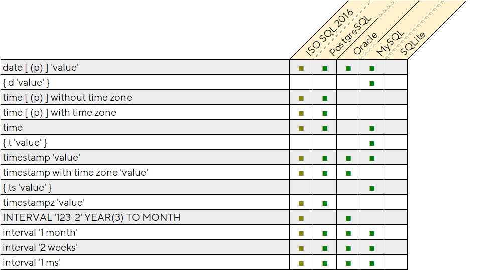

It's easy to recognize that SQLite does not support standard SQL
time-related types and corresponding syntax here, and that PostgreSQL is
most advanced here - it's the sole vendor which supports the OVERLAPS
expression.

But, if we compare their functions, then the pictures becomes very messy
and complicated:

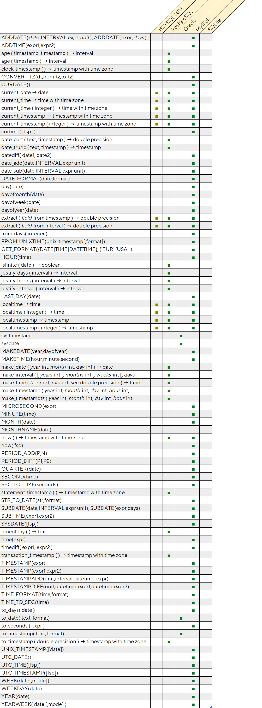

We believe, that from practical perspective we need to be as close to
PostgreSQL as possible.

### PostgreSQL example of storage and ranges of datetime types

As described in [PostgreSQL 13 \| Date/Time Types \| 8.5. Date/Time
Types](https://www.postgresql.org/docs/current/datatype-datetime.html)
datetime types have the following storage sizes and supported ranges:

| **Name**                                    | **Storage Size** | **Description**                       | **Low Value**    | **High Value**  | **Resolution** |
|---------------------------------------------|------------------|---------------------------------------|------------------|-----------------|----------------|
| timestamp \[ (p) \] \[ without time zone \] | 8 bytes          | both date and time (no time zone)     | 4713 BC          | 294276 AD       | 1 microsecond  |
| timestamp \[ (p) \] with time zone          | 8 bytes          | both date and time, with time zone    | 4713 BC          | 294276 AD       | 1 microsecond  |
| Date                                        | 4 bytes          | date (no time of day)                 | 4713 BC          | 5874897 AD      | 1 day          |
| time \[ (p) \] \[ without time zone \]      | 8 bytes          | time of day (no date)                 | 00:00:00         | 24:00:00        | 1 microsecond  |
| time \[ (p) \] with time zone               | 12 bytes         | time of day (no date), with time zone | 00:00:00+1559    | 24:00:00-1559   | 1 microsecond  |
| interval \[ fields \] \[ (p) \]             | 16 bytes         | time interval                         | -178000000 years | 178000000 years | 1 microsecond  |

### SQL-Server example of datetime storage and ranges supported

As described in [Microsoft SQL-Server docs \| Transact-SQL (T-SQL) \|
Reference Functions \| Date &<u>
</u>time](https://docs.microsoft.com/ru-ru/sql/t-sql/functions/date-and-time-data-types-and-functions-transact-sql?view=sql-server-ver15%23date-and-time-data-types)
datetime types have the following storage sizes and supported ranges:

| Data type                                                                                                                 | Format                                        | Range                                                                    | Accuracy        | Storage size (bytes) | User-defined fractional second precision | Time zone offset |
|---------------------------------------------------------------------------------------------------------------------------|-----------------------------------------------|--------------------------------------------------------------------------|-----------------|----------------------|------------------------------------------|------------------|
| [time](https://docs.microsoft.com/en-us/sql/t-sql/data-types/time-transact-sql?view=sql-server-ver15)                     | hh:mm:ss\[.nnnnnnn\]                          | 00:00:00.0000000 through 23:59:59.9999999                                | 100 nanoseconds | 3 to 5               | Yes                                      | No               |
| [date](https://docs.microsoft.com/en-us/sql/t-sql/data-types/date-transact-sql?view=sql-server-ver15)                     | YYYY-MM-DD                                    | 0001-01-01 through 9999-12-31                                            | 1 day           | 3                    | No                                       | No               |
| [smalldatetime](https://docs.microsoft.com/en-us/sql/t-sql/data-types/smalldatetime-transact-sql?view=sql-server-ver15)   | YYYY-MM-DD hh:mm:ss                           | 1900-01-01 through 2079-06-06                                            | 1 minute        | 4                    | No                                       | No               |
| [datetime](https://docs.microsoft.com/en-us/sql/t-sql/data-types/datetime-transact-sql?view=sql-server-ver15)             | YYYY-MM-DD hh:mm:ss\[.nnn\]                   | 1753-01-01 through 9999-12-31                                            | 0.00333 second  | 8                    | No                                       | No               |
| [datetime2](https://docs.microsoft.com/en-us/sql/t-sql/data-types/datetime2-transact-sql?view=sql-server-ver15)           | YYYY-MM-DD hh:mm:ss\[.nnnnnnn\]               | 0001-01-01 00:00:00.0000000 through 9999-12-31 23:59:59.9999999          | 100 nanoseconds | 6 to 8               | Yes                                      | No               |
| [datetimeoffset](https://docs.microsoft.com/en-us/sql/t-sql/data-types/datetimeoffset-transact-sql?view=sql-server-ver15) | YYYY-MM-DD hh:mm:ss\[.nnnnnnn\] \[+\|-\]hh:mm | 0001-01-01 00:00:00.0000000 through 9999-12-31 23:59:59.9999999 (in UTC) | 100 nanoseconds | 8 to 10              | Yes                                      | Yes              |

### Datetime support and plan of actions

So, we suggest implementing the following functionality for Tarantool
datetime support (please compare to the standard, and to PostgreSQL
entries).

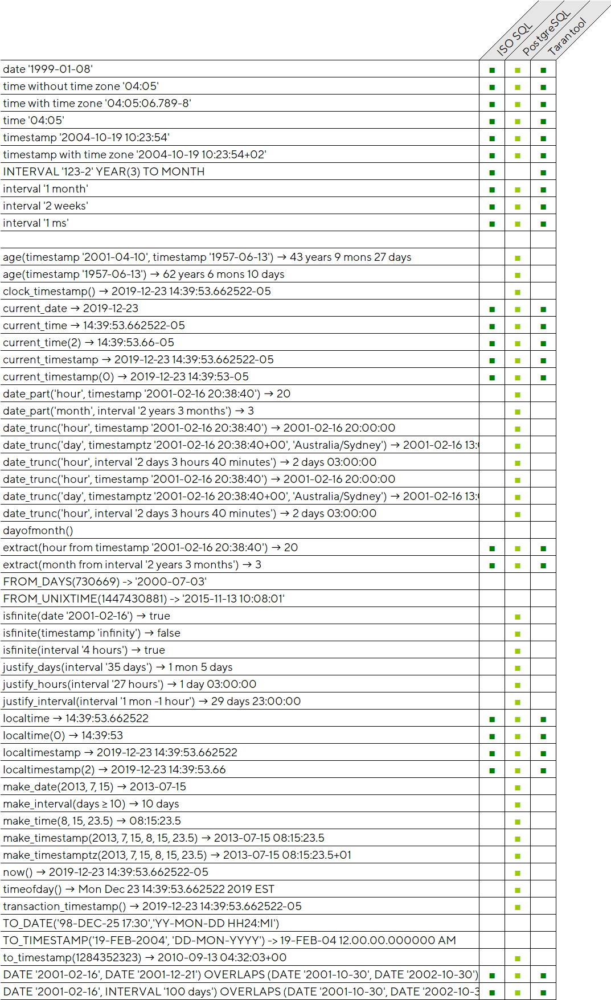

*NB! The list of supported functions is debatable.*

#### Tarantool DATETIME - plan of actions

1.  Benchmark possible 3rd party datetime implementations (icu-date
    against others). Pick fastest
    [\#5947](https://github.com/tarantool/tarantool/issues/5947).
    Implement Lua module wrapping his functionality;

2.  Introduce date/time types serialization to Tarantool MessagePack
    [\#5946](https://github.com/tarantool/tarantool/issues/5946);

3.  Temporarily restore SQLite functions (for current TPC-H benchmark
    facilities). Immediately mark them deprecated;

4.  Introduce standard SQL date/time/timestamp types to the parser (not
    literal yet),
    rework the above functions to use new underlying storage instead of
    former SQLite storage types;

5.  Add selected list of required built-ins (as close to standard as
    possible).
    Implement them using icu-date or another library (earlier selected
    at item #1 above);

6.  Add datetime literals and their expressions support (date, time,
    timestamp, intervals);

## UUIDs

UUID type is just a binary type of given length (128-bit). Storage,
collation and comparison should be defined in the box implementation.
From the SQL perspective we introduce a new primary type UUID, which
behaves very much like any other BLOB-type.

At the moment there is no plan to introduce any special handling of
string literals with the form `'33bb9554-c616-42e6-a9c6-88d3bba4221c'`.

String literals and string expressions may be implicitly converted to
UUID if they have proper format. Converting UUID to STRING is only
possible via explicit cast.

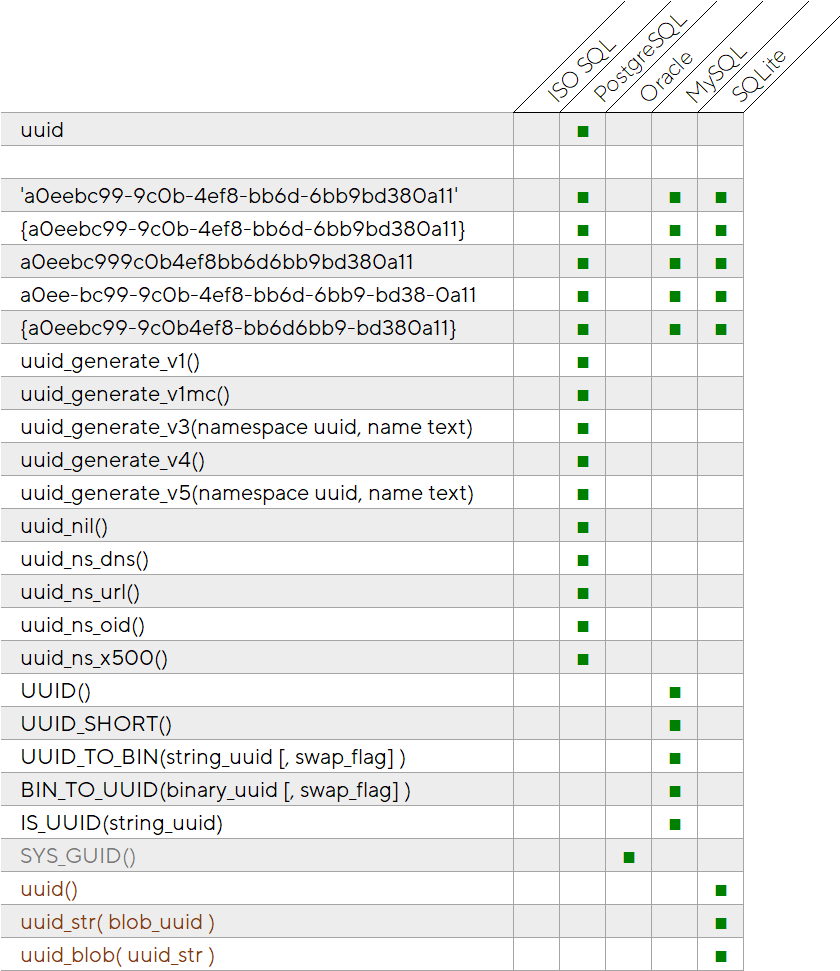

ISO SQL does not require any UUID support from SQL vendors, thus all
known vendors implement it slightly differently.

The worst uuid implementation, out of all those mentioned above in the
table, is Oracle SYS\_GUID() which generates a UUID that is not *even
RFC 4122-compliant*!

Both MySQL and SQLite use similar approaches - providing a set of
functions for conversion of string to blob, and the reverse.

The most complete implementation seemingly is in PostgreSQL, which
allows various relaxed formats for string literals which may be accepted
as UUID - the plan is to be as close as possible to PostgreSQL here.
Also, PostgreSQL provides several flavors of `uuid_generate*` functions
to allow generation of different versions of standard GUIDs. Tarantool
box generates only one version - which is frequently a limitation in
practice (e.g. for importing 3rd party data).

### Tarantool UUID - plan of actions

The suggestion is:

-   Introduce `UUID([version#])` functions which would allow generating any
    particular type of GUID. If version argument is omitted then we
    generate UUID v4 (as used by default in box);

-   Implement explicit casts for conversion between string and uuid, i.e.
    `CAST(uuid AS STRING)` and `CAST(str AS UUID)`;

-   Similarly, implement explicit casts for conversion between varbinary of
    16 bytes length, correct content and uuid, i.e. `CAST(uuid AS VARBINARY)`
    and `CAST(blob AS UUID)`;

-   Beyond special semantics on conversion from strings, UUIDs are simply uuid
    types as implemented in box, with all their constraints and limitations,
    and behave like blobs;

-   UUIDs are comparable similar to the way that blobs are comparable,
    i.e. they use bytewise comparison operators;


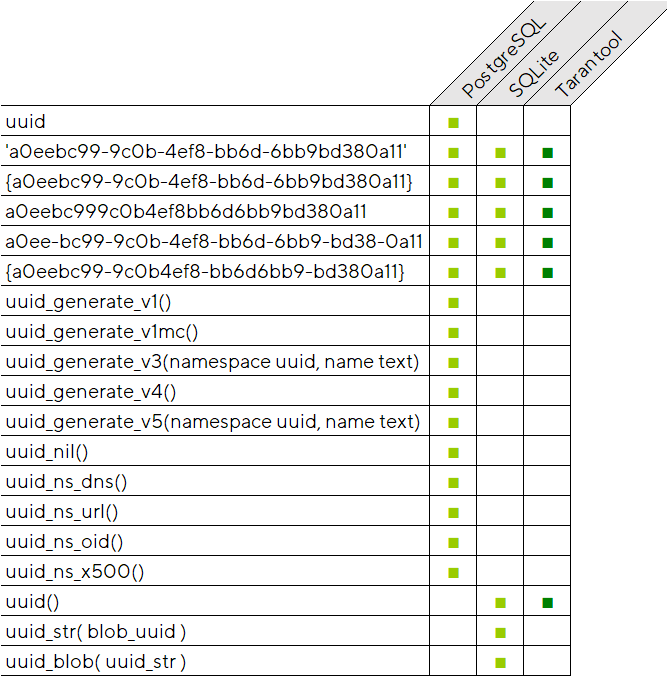

## Array

Nikita has opened an issue for array support in syntax - *"sql:
introduce type &lt;ARRAY&gt;"
[\#4762](https://github.com/tarantool/tarantool/issues/4762)*

This issue was requesting only a set of built-in functions, and was not
asking much of syntax extensions.

> To access array elements in first implementation iteration it is
> suggested to consider built-in helpers like:
> - `array_get('field_name', 'element_index')`;
> - `array_set('field_name', 'element_index', 'new_value')`;
> - `array_create('values', ...)`;
>
> ```sql
>
> CREATE TABLE t (i INT PRIMARY KEY, a ARRAY);
>
> INSERT INTO t VALUES (1, array_create(1, 2, 3));
> INSERT INTO t VALUES (2, array_create(2.123, 'asd'));
>
> SELECT * FROM t;
> ---
> - - [1, [1, 2, 3]]
> - [2, [2.123, 'asd']]
> ...
>
> SELECT a FROM t;
> ---
> - - [[1, 2, 3]]
> - [[2.123, 'asd']]
>
> SELECT array_get(a, 1);
> - - [1]
> - [2.123]
>
> SELECT array_get(a, 2), array_get(a, 3) FROM t;
> - - [2, 3]
> - ['asd', NULL]
> ```
>
> Alternatively, array\_get() may accept a third optional argument
> indicating a default value in case the array index is out of bounds.
> Note that throwing an error in this case is likely to be unacceptable
> since arrays may have a variable number of elements.
>
> ```sql
> UPDATE t SET array_set(a, 2, 'abc') WHERE array_get(a, 2) = 2;
>
> ```
>
> array\_get() and array\_set can be replaced with \[ \] indexation
> operation later.

This proposal looks very easy to implement, but is not very SQL-ish.
The ISO SQL:2016 standard does have ARRAY type support, and many vendors
implement it according to standard rules.


There is in standard SQL:2016 a simple \[\] syntax for accessing
elements of ARRAYs, and DB2, PostgreSQL and Oracle support it.

All of them have different sets of array-supporting built-ins (and
PostgreSQL has an especially long list of functions in its extension).
But from a practical perspective there is not much value in supporting
anything beyond ISO SQL functions.

### Tarantool ARRAYs - plan of actions

So, the plan is:

-   To add \[\] support to the parser to define columns and access array
    field element values;
-   Add CARDINALITY(array)
-   Add TRIM\_ARRAY(array)
-   Add ARRAY\_AGG(expression,...)

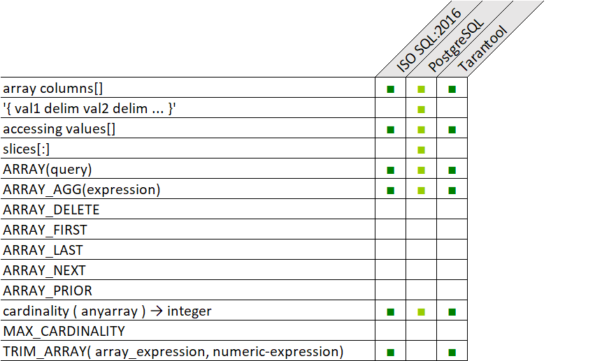

Such fields will be stored as MP\_ARRAY encoded tables in box.

*NB! An open question is - should we export TRIM\_ARRAY and ARRAY\_AGG
to their Lua counterparts?*

## Map

Similar to Nikita's proposal about arrays, maps support might be
implemented via a set of builtin functions. Please see proposal from
Nikita in "sql: introduce type &lt;MAP&gt;
[\#4763](https://github.com/tarantool/tarantool/issues/4763)" -
[\#4763](https://github.com/tarantool/tarantool/issues/4763)

> To access array elements in the first implementation iteration it is
> suggested to consider built-in helpers like:
> - `map_get('field_name', 'element_index')`;
> - `map_set('field_name', 'element_index', 'new_value')`;
> - `map_create('name', 'value', ...)`;
>
> ```sql
> CREATE TABLE t (i INT PRIMARY KEY, a ARRAY);
> INSERT INTO t VALUES (1, map_create('a', 1, 'b', 2,));
> INSERT INTO t VALUES (2, map_create('b', 2, 'a', 'asd', 5, 1));
>
> SELECT * FROM t;
> ---
> - - [1, {'a': 1, 'b': 2}]
> - [2, {'b': 2, 'a': 'asd', 5: 1}]
> ...
>
> SELECT a FROM t;
> ---
> - - [{'a': 1, 'b': 2}]
> - [{'b': 2, 'a': 'asd', 5: 1}]
>
> SELECT map_get(a, 'a');
> - - [1]
> - ['asd']
>
> SELECT map_get(a, 5) FROM t;
> - - [NULL]
> - [1]
> ```
>
> Alternatively, map\_get() may accept a third optional argument
> indicating a default value in case map lacks a given key. Note that
> throwing an error in this case is likely to be unacceptable since map
> may feature different sets of keys.
>
> ```sql
> UPDATE t SET map\_set(a, 'a', 'abc') WHERE map\_get(a, 'a') = 2;
>...
> ```
>
> map\_get() and map\_set() can be replaced with { } indexation
> operation later.

There is no (and hardly ever could be) pure ISO SQL aggregate type
similar to box map. However, it is a natural concept for NoSQL
databases, and is supported by Cassandra CQL, as an example. Here is
excerpt from [The Cassandra Query Language (CQL) \| Data Types \|
Collections \|
Maps](https://cassandra.apache.org/doc/latest/cql/types.html%23maps):

> A map is a (sorted) set of key-value pairs, where keys are unique and
> the map is sorted by its keys. You can define and insert a map with:
>
> ```sql
> CREATE TABLE users (
>
> id text PRIMARY KEY,
>
> name text,
>
> favs map&lt;text, text> // A map of text keys, and text values
>
> );
>
> INSERT INTO users (id, name, favs)
>
> VALUES ('jsmith', 'John Smith', { 'fruit' : 'Apple', 'band' :
> 'Beatles' });
>
> // Replace the existing map entirely.
>
> UPDATE users SET favs = { 'fruit' : 'Banana' } WHERE id = 'jsmith';
> ```
>
> Further, maps support:
>
> - Updating or inserting one or more elements:
>
> ```sql
> UPDATE users SET favs['author'] = 'Ed Poe' WHERE id = 'jsmith';
>
> UPDATE users SET favs = favs + { 'movie' : 'Cassablanca', 'band' : 'ZZ
> Top' } WHERE id = 'jsmith';
> ```
>
> - Removing one or more elements (if an element doesn't exist, removing
>   it is a no-op but no error is thrown):
>
> ```sql
> DELETE favs['author'] FROM users WHERE id = 'jsmith';
>
> UPDATE users SET favs = favs - { 'movie', 'band'} WHERE id = 'jsmith';
> ```
>
> Note that for removing multiple elements in a map, you remove a set of
> keys from it.
>
> Lastly, TTLs are allowed for both INSERT and UPDATE, but in both cases
> the TTL set only applies to the newly inserted/updated elements. In
> other words:
>
> ```sql
> UPDATE users USING TTL 10 SET favs['color'] = 'green' WHERE id =
> 'jsmith';
> ```
>
> will only apply the TTL to the `{ 'color' : 'green' }` record, the rest
> of the map remaining unaffected.

### MAPs in Tarantool SQL - plan of actions

Just do as Cassandra does:

-   Use {} for map (collection) definition;

-   Reuse \[\] for element access;

-   *With the exception of* map&lt;type-key, type-value&gt; *syntax in
    table definition. That's looking not very SQL-ish and we may decide
    to use different syntax here;*

## BIT

ANSI SQL:99 types BIT/BIT VARYING are (were) equivalent to BINARY /
VARBINARY, so for storage we could make them aliases to binary of
corresponding length, and that would be pretty much it. But...

Despite the fact that BIT/BIT VARYING still is claimed as "standard"
features in
[PostgreSQL](https://www.postgresql.org/docs/13/datatype-bit.html) /
Greenplum and
[SQL-Server](https://docs.microsoft.com/en-us/sql/t-sql/data-types/bit-transact-sql?view=sql-server-ver15)
and by some other SQL vendors, it's **not in SQL:2016**, because it has
been removed from SQL:2003.

## XML

XML types support is in SQL standard since SQL:2003. *Nobody actually
cares about that, so we should rather not bother with XML at the
moment.*

### XML in Tarantool SQL - plan of actions

-   Do nothing. Wait and see

## JSON

\[Strictly speaking this might be out-of-topic for the current paper,
because we are not speaking about an SQL type per se, but for
completeness...\]

ISO SQL:2016 adds json support, but does it differently than for XML.

```sql

CREATE TABLE ... ( jcol CLOB CHECK (jcol IS JSON) );
    [{id: 1, name: "Marvin"},
    {id: 2, name: "Arthur"}
    ]

SELECT jt.*
FROM t,
    JSON_TABLE
    ( jcol,
        '$[*]'
        COLUMNS
            (id NUMERIC PATH '$.id',
            name VARCHAR(255) PATH '$.name'
            )
    ) jt
```

There is no special JSON type added, but rather a lot of functions to
operate with string or binary data. For implementation we could rely
here on already available support of json-path in Tarantool box. But
let us leave decision here to future discussions. However, json is doable.


### JSON in Tarantool SQL - plan of actions

-   Do nothing (as with XML). Wait and see;
-   It's doable, though, given current [json\_path support in
    Tarantool](https://www.tarantool.io/en/doc/latest/reference/reference_lua/json_paths/),
    but plans are subject to discussion;

# SQL conversion rules


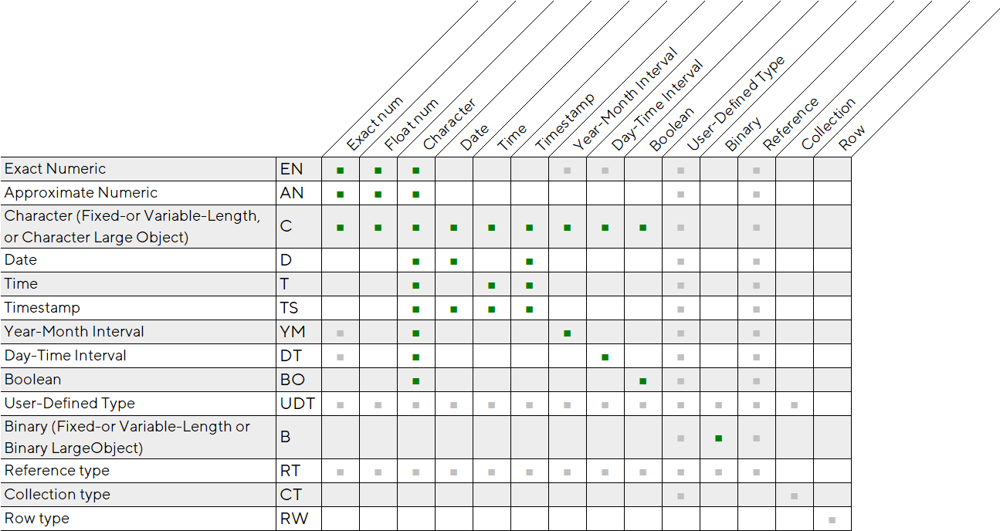

ISO SQL:2016 has a convenient table for explicit type conversion which
might be done for different standard types. There is no drawn implicit
conversion table though. \[At least we didn't find it\]

Let us put aside user-defined types (which we not support at the moment
for SQL mode), references, rows, and collections (array/map), and see
the rest of the table entries.

We see that string data could be conditionally converted to any other
(we name them "scalar") types.

We see that integer and float types might be converted to strings and to
each other.

There is more complex correspondence between date/time types, but they
are behaving reasonably and according to intuition.

### Example, Oracle conversion table


Among other SQL vendors only Oracle and Microsoft provide human-readable
conversions tables in their documentation. Please see the Oracle version
above, as described in [SQL Language Reference \| Data Type Comparison
Rules \| Implicit and Explicit Data
Conversion](https://docs.oracle.com/en/database/oracle/oracle-database/21/sqlrf/Data-Type-Comparison-Rules.html#GUID-4C49C87F-F170-43CC-9EDC-2403576610DF)

For the sake of completeness, we show an explicit conversion table from
the same version of Oracle 21 from [SQL Language Reference \| Data Type
Comparison Rules \| Explicit Data
Conversion](https://docs.oracle.com/en/database/oracle/oracle-database/21/sqlrf/Data-Type-Comparison-Rules.html#GUID-D0C5A47E-6F93-4C2D-9E49-4F2B86B359DD)


### Example, Microsoft SQL-Server conversion table

SQL-Server documentation in their article [Transact-SQL (T-SQL) \|
Reference \| Data types \| Conversion \| Implicit and explicit
conversion](https://docs.microsoft.com/en-us/sql/t-sql/data-types/data-type-conversion-database-engine?view=sql-server-ver15#implicit-and-explicit-conversion)
shows an absolutely outstanding conversion table, which compresses in
single place information about whether this combination of input and
output data type could be implicitly or explicitly converted. We would
rather not use that approach and, for the sake of simplicity, would
split implicit and explicit tables (similar to the Oracle version), but
we could not resist praising this effort.


*NB! There are a lot of extended types which are not SQL standard (like
CLR UDT, money or hierarchyid). We do not care about them at the
moment.*

### Example: integer and floating types in MS SQL-Server

Example, MS SQL-Server about **integer** types:

| **Data type** | Range                                                                    | **Storage** |
|---------------|--------------------------------------------------------------------------|-------------|
| **bigint**    | -2^63 (-9,223,372,036,854,775,808) to 2^63-1 (9,223,372,036,854,775,807) | **8 Bytes** |
| **int**       | -2^31 (-2,147,483,648) to 2^31-1 (2,147,483,647)                         | **4 Bytes** |
| **smallint**  | -2^15 (-32,768) to 2^15-1 (32,767)                                       | **2 Bytes** |
| **tinyint**   | 0 to 255                                                                 | **1 Byte**  |

Example, Microsoft SQL-Server about **real** / **float** types

> The ISO synonym for **real** is **float(24)**.
>
> **float** \[ **(***n***)** \] Where *n* is the number of bits that are
> used to store the mantissa of the **float** number in scientific
> notation and, therefore, dictates the precision and storage size. If
> *n* is specified, it must be a value between **1** and **53**. The
> default value of *n* is **53**.

| ***n value*** | ***Precision***                                              | ***Storage size***        |
|---------------|--------------------------------------------------------------|---------------------------|
| **1-24**      | 7 digits                                                     | 4 bytes                   |
| **25-53**     | 15 digits                                                    | 8 bytes                   |
| **Data type** | Range                                                        | Storage                   |
| **float**     | \- 1.79E+308 to -2.23E-308, 0 and 2.23E-308 to 1.79E+308     | Depends on the value of n |
| **real**      | \- 3.40E + 38 to -1.18E - 38, 0 and 1.18E - 38 to 3.40E + 38 | 4 Bytes                   |

> SQL Server treats *n* as one of two possible values. If
> **1**&lt;=n&lt;=**24**, *n* is treated as **24**. If
> **25**&lt;=n&lt;=**53**, *n* is treated as **53**.
>
> The SQL Server **float**\[**(n)**\] data type complies with the ISO
> standard for all values of *n* from **1** through **53**. The synonym
> for **double precision** is **float(53)**.

> Prior to SQL Server 2016 (13.x), conversion of **float** values to **decimal** or **numeric** is restricted to values of precision 17 digits only. Any **float** value less than 5E-18 (when set using either the scientific notation of 5E-18 or the decimal notation of 0.0000000000000000050000000000000005) rounds down to 0. This is no longer a restriction as of SQL Server 2016 (13.x).

### Example, MySQL conversion table

Unfortunately, there is no drawn clear and concise conversion table for
the MySQL SQL flavor. Rules are described verbally [MySQL 8.0 Reference
Manual / Functions and Operators / Type Conversion in Expression<u>
</u>Evaluation](https://dev.mysql.com/doc/refman/8.0/en/type-conversion.html)
so it's hard to reconstruct the full table. Here is my weak attempt to
represent MySQL's implicit conversion table:

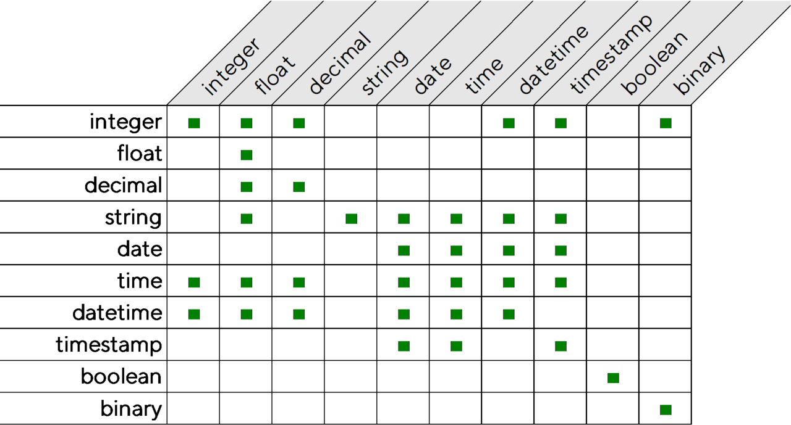

*NB! Please let us know if you have some corrections for the above
table, we still want to have correct and up-to-date information
represented in our document.*

Example, Type conversion rules in MySQL
<https://dev.mysql.com/doc/refman/8.0/en/type-conversion.html>

> MySQL automatically converts strings to numbers as necessary, and vice
> versa.
>
> ```
> mysql> SELECT 1+'1';
>
> -> 2
>
> mysql> SELECT CONCAT(2,' test');
>
> -> '2 test'
> ```
>
> It is also possible to convert a number to a string explicitly using
> the
> [<u>CAST()</u>](https://dev.mysql.com/doc/refman/8.0/en/cast-functions.html#function_cast)
> function. Conversion occurs implicitly with the
> [<u>CONCAT()</u>](https://dev.mysql.com/doc/refman/8.0/en/string-functions.html#function_concat)
> function because it expects string arguments.
> ```
> mysql> SELECT 38.8, CAST(38.8 AS CHAR);
>
> -> 38.8, '38.8'
>
> mysql> SELECT 38.8, CONCAT(38.8);
>
> -> 38.8, '38.8'
>
> ...
> ```
>
> In all other cases, the arguments are compared as floating-point
> (real) numbers. For example, a comparison of string and numeric
> operands takes place as a comparison of floating-point numbers.

### Example, PostgreSQL conversion table

We experience similar problems when we try to visualize implicit and
explicit casts in PostgreSQL, because there is no such table in the
documentation. [PostgreSQL 13.2 Documentation \| Part II. The SQL
Language \| 10. Type
Conversion](https://www.postgresql.org/docs/13/typeconv.html)

> There are four fundamental SQL constructs requiring distinct type
> onversion rules in the PostgreSQL parser:
>
> **Function calls**
>
> Much of the PostgreSQL type system is built around a rich set of
> unctions. Functions can have one or more arguments. Since PostgreSQL
> ermits function overloading, the function name alone does not uniquely
> dentify the function to be called; the parser must select the right
> unction based on the data types of the supplied arguments.
>
> **Operators**
>
> PostgreSQL allows expressions with prefix and postfix unary
> one-argument) operators, as well as binary (two-argument) operators.
> ike functions, operators can be overloaded, so the same problem of
> electing the right operator exists.
>
> **Value Storage**
>
> SQL INSERT and UPDATE statements place the results of expressions into
>  table. The expressions in the statement must be matched up with, and
> erhaps converted to, the types of the target columns.
>
> ...
>
> The system catalogs store information about which conversions, or
> asts, exist between which data types, and how to perform those
> onversions. Additional casts can be added by the user with the CREATE
> AST command. (This is usually done in conjunction with defining new
> ata types. The set of casts between built-in types has been carefully
> rafted and is best not altered.)

Here we probably give up the idea to build a conversion table for PostgreSQL.

## Comparison operators

Comparison inside of Tarantool `box` is done in rather straightforward way:

- for column of particular basic type (i.e. not `scalar`) we call specific
  comparator function (e.g. `mp_compare_bool`, `mp_compare_number`,
  `mp_compare_str`, etc.), which knows how to compare data types of
  particular type;

- but for `scalar` comparison rules there are 2 steps used:

  - if data, to be compared, are of different MessagePack types then
    we interpret their types according to the hierarchy below
    (`tuple_compare.cc#enum mp_class`):

    `nil` < `bool` < **`number`** < `string` < `binary` < `uuid` < `array` < `map`

    *It worth to note that single comparison class **`number`** includes all
    kinds of numeric MessagePack data, namely `MP_UINT`, `MP_INT`, `MP_FLOAT`,
    `MP_DOUBLE` and `MP_DECIMAL`.*

  - but if data values are of the same type - then box uses type specific
    comparators as mentioned above.

To have consistent results between SQL comparison operators (e.g. <, >, =, etc.)
and box iterators we should use **same comparison rules** for SQL types we have
now or would have in future.

We essentially disable implicit conversion rules between most of types, with
exception of numeric values (i.e. integer, float or decimal) for which conversion
automatically performed in their class comparator function.

## SCALAR conversion issues

`SCALAR` field data type, as introduced to Tarantool box model, is not
very much compatible with pure SQL model, where column index could contain
only homogeneous data, while box `SCALAR` allows to have all kinds of (scalar)
data to be saved to the same column, and correctly sorted and compared in
the index.

If we apply same implicit conversion rules, designed for arithmetic operations,
to comparisons with scalar `SCALAR` values, then we could get conflicting
results given we used index or not. E.g.:

```
tarantool> box.execute('CREATE TABLE t (i SCALAR PRIMARY KEY, a SCALAR);')
---
- row_count: 1
...

tarantool> box.execute('INSERT INTO t VALUES (10, 10);')
---
- row_count: 1
...

tarantool> box.execute([[SELECT * FROM t WHERE i < '1';]])
---
- metadata:
  - name: I
    type: scalar
  - name: A
    type: scalar
  rows:
  - [10, 10]
...

tarantool> box.execute([[SELECT * FROM t WHERE a < '1';]])
---
- metadata:
  - name: I
    type: scalar
  - name: A
    type: scalar
  rows: []
...
```

* To avoid this problem we decided to __not use__ generic implicit conversion table
  for comparisons, essentially disabling them, and use instead box' [comparison rules]
  (#comparison-operators);

* With special treatment of comparisons we do not need to disable implicit casts
  altogether for scalar columns (as it were suggested before by some one).
  It's not cast was problem here, but different results from iterators.

## Implicit casts

Here is the original picture of implicit conversions that we do in vdbe
code:

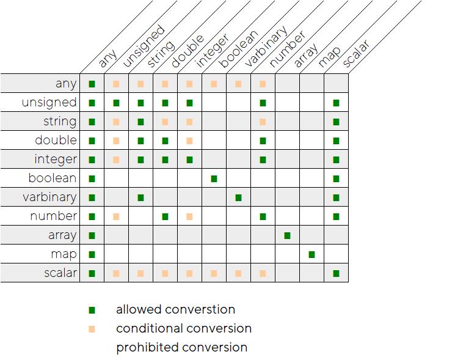

"Integer" (actually negative integer) and "unsigned" make up the generic
"integer" type. Number is a superset of generic integer and double.
(There is no smaller 4-byte float data type, as in other SQL vendors'
tables, because it does not make much sense for NoSQL storage).

Here are a few comments about possible combinations in the above table:

-   Depending on current value content of `any` typed column, it may be
    conditionally converted to any other target type;

-   The same conditional logic applies for `scalar` to any other
    (scalar) target type.

-   Integer (unsigned and signed) values might be implicitly converted
    from strings (if passed in proper format), double (if conversion
    would be lossless) or from another integer value. `number` is
    supertype for integers and floats, thus these conditions are correct
    for conversion from `number` as well;

-   Similarly, conversion to `double` might be performed from `string`,
    `integer`, another `float`, or `number`;

-   `boolean`s can only be converted to `boolean`s;

-   `varbinary` can be converted to `string` and `varbinary`. The reverse is
    not true for string to varbinary conversion, it's not allowed for
    implicit cast (but is allowed for _explicit_ cast).
    
    Please, be warned that it will be changed in future conversion tables, where
    these conversions to become bi-directional in the new implicit table;

-   Aggregate types like `array` or `map` can only be converted to array or
    map correspondingly. This is already in the code and does not
    require any addition after native ARRAY/MAP support will be added to the
    SQL parser;


### Proposed implicit cast table with newer types

In general we should follow this principle while changing current conversion table: 
- a value `x` of `type A` can be casted to the `type B` only if resulted value `x'`
  of the `type B` after that can be casted back into `type A` and the resultant
  new value `x''` of `type A` matches the original value `x`.

For all new SQL types we spoken before, and to make table consistent, we do not
need to introduce much changes to the current implicit conversion table shown above.
Array and map are already there and in correct places, and only omitted now are
new uuid type, and several datetime types.

With the addition of newer SQL types (uuid, datetime, etc.) we would
have the following implicit conversion table:

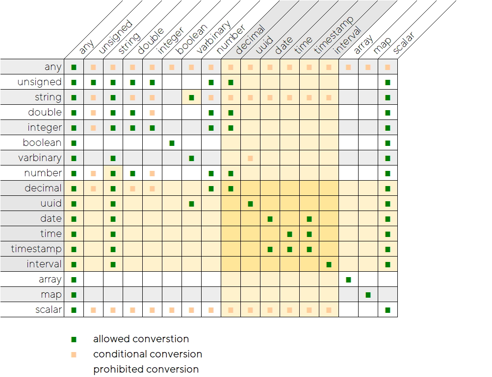

> Cells with highlighted background represents additions or modifications
> of older convention.

-   Date/time/timestamp/intervals entries here are just copy-pasted from
    the ISO SQL:2016 table above, and may be changed in the final
    implementation;
-   If you pay attention to the decimal row then you could recognize
    that it behaves like other numeric types;


## Explicit casts


In SQL we could use several ways to explicitly cast from one argument
type to another, either via `CAST(x AS T)` or via a special purpose
built-in function.

### Example, ClickHouse explicit casts

ClickHouse is a good example of using both built-in functions and CAST
expressions for explicit cast of given value to particular target type -
https://clickhouse.tech/docs/en/sql-reference/functions/type-conversion-functions/

-   `toUInt(8|16|32|64|256)OrZero`
-   `toUInt(8|16|32|64|256)OrNull`
-   `toFloat(32|64)`
-   `toFloat(32|64)OrZero`
-   `toFloat(32|64)OrNull`
-   `toDate`
-   `toDateOrZero`
-   `toDateOrNull`
-   `toDateTime`
-   `toDateTimeOrZero`
-   `toDateTimeOrNull`
-   `toDecimal(32|64|128|256)`
-   `toString`
-   `toFixedString`
-   `toInterval(Year|Quarter|Month|Week|Day|Hour|Minute|Second)`
-   `CAST(x, T)`
-   `CAST(x AS t)`
-   And `accurateCast(x, T)` which checks for overflow and raises run-time
    exceptions;

### Current explicit conversion table

With the exception of Oracle and Microsoft SQL-Server we did not show
explicit casts tables (for Oracle there was a separate function, and for
SQL-Server it was integrated to the common table), but the principle
is simple: use CAST() or function.

Here is the currently implemented table of explicit conversions for
VDBE:

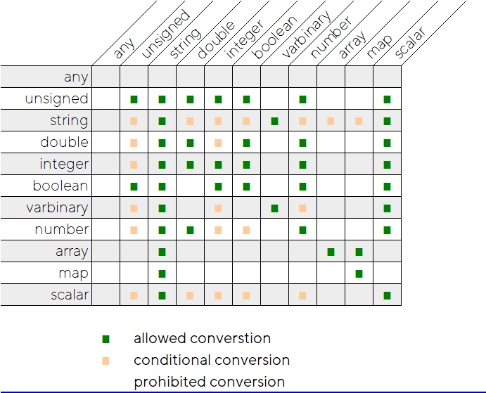

### Proposed table for explicit conversions with newer types


> Cells with highlighted background represents additions or modifications
> of older convention.

-   Strings may be converted to array or map, if they are of correct
    syntax;
-   Arrays may be converted to map (using perl approach, when even items
    become keys, while odd items - corresponding values);
-   Various numeric types may be casted to date/time/timestamp and
    intervals, and vice versa;


