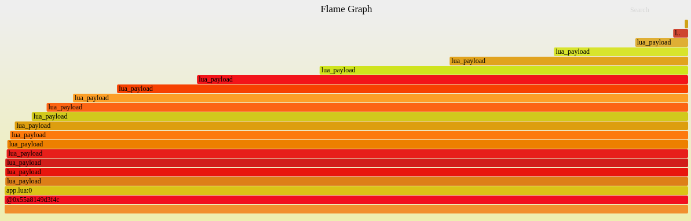
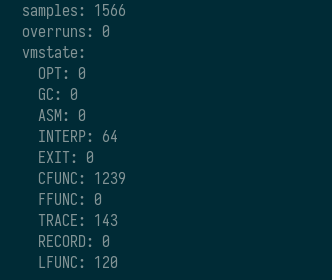
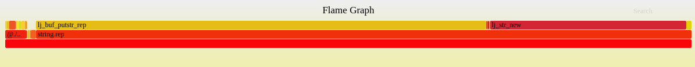

# lua: system-wide profiler

* **Status**: Done
* **Start date**: 02-07-2021
* **Authors**: Mikhail Shishatskiy @Shishqa m.shishatskiy@tarantool.org, Maxim Kokryashkin @fckxorg m.kokryashkin@tarantool.org
* **Issues**: [#781](https://github.com/tarantool/tarantool/issues/781), [#4001](https://github.com/tarantool/tarantool/issues/4001)

## Summary
The document describes the platform profiler for LuaJIT. It is needed to obtain a complete view of platform performance. The existing LuaJIT profiler is only able to give you information about virtual machine states and guest stacks. Hence, the document proposes to provide a new sampling profiler, so it will be able to gather stack traces from both C and Lua.

## Background and motivation

Currently, the available options for profiling LuaJIT are not fine enough to provide an understanding of performance. For example, perf is only able to show the host stack, so all the Lua calls are seen as a single pcall. Oppositely, the jit.p module provided with LuaJIT is not able to give any information about the host stack.

To get a detailed perspective on the platform's performance, a more advanced profiler is needed. The desired profiler must be able to capture both guest and host stacks simultaneously, along with virtual machine states.

Assume we have the following chunks of code:
```c
1  // file c_payload.c
2
3  // fibonnacci number
4  double c_payload(double n) {
5    if (n <= 1) {
6      return n;
7    }
8    return c_payload(n - 1) + c_payload(n - 2);
9  }
```

```lua
 1  -- file lua_payload.lua
 2
 3  local jit = require("jit")
 4  local ffi = require("ffi")
 5  local os = require("os")
 6
 7  ------------------------------------------------
 8
 9  -- fibonacci number
10  function lua_payload(n)
11    if n <= 1 then
12      return n
13    end
14    return lua_payload(n - 1) + lua_payload(n - 2)
15  end
16
17  -- mind project-specific package location --
18  local c = ffi.load("c_payload")
19
20  ffi.cdef[[
21  double c_payload(double n);
22  ]]
23
24  ------------------------------------------------
25
26  local start_time = os.clock()
27  local benchmark_time = 10
28
29  jit.off()
30  jit.flush()
31
32  local i = 0
33  while os.clock() - start_time < benchmark_time do
34      if i % 2 == 0 then
35          c.c_payload(20)
36      else
37          lua_payload(20)
38      end
39      i = i + 1
40  end
```

The `c_payload.c` code was compiled into a shared library and loaded by LuaJIT via the FFI.

To see the difference, you can take a look at the flamegraphs (learn more about [flamegraphs](https://www.brendangregg.com/flamegraphs.html)) for this code generated by perf, jit.p, and PoC for the proposed profiler below.

### perf


### jit.p


### sysprof


As you can see, the output of sysprof looks like merged flamegraphs from perf and jit.p.

## Detailed design

The proposed approach is to reuse the backend implemented in the existing `jit.p` profiler and add host stack capturing on top of it. It is important that we create a different API for the new profiler so the user can choose which one is preferable for a particular case. But only one profiler can be used at a time.

### Prerequisites
Firstly, it is necessary to make the timer machinery in `lj_profile.c` self-reliant by introducing `lj_profile_timer` structure and a start/stop interface for it. This makes the timer useful not only for jit.p but for sysprof too.

Another thing to do is to fix an invalid VM state during stack resizing. The issue itself is similar to the `tarantool/tarantool#5842`.

### Host stack

The default sampling profiler implementation in the LuaJIT, which can be seen [here](https://github.com/tarantool/luajit/blob/tarantool/src/lj_profile.c), follows this flow:
```
luaJIT_profile_start --> profile_timer_start

...
                                                    |lock VM state
[signal emitted] --> profile_signal_trigger:      __|prepare args for a callback
                                                    |schedule callback execution
                                                    |unlock VM state
...

luaJIT_profile_stop --> profile_timer_stop
```

The callback, which is scheduled by `profile_signal_trigger` can be used to dump needed information, including the VM stack. However, the mechanism of VM hooks is used for a callback, so it executes later than the signal was emitted. That is why even though the guest stack is still the same by the time a callback is executed, the host stack has been changed already, so the final stack dump cannot be considered valid.

Hence, to get a valid final snapshot of both stacks, a dump should be done right at the signal, like [there](https://github.com/Shishqa/luajit/blob/c0da971640512696f5c166e8f2dc1ed982a8f451/src/profile/sysprof.c#L63).

The host stack can be dumped with a libunwind-based unwinder, since it can deal with DWARF tables and is signal-safe. However, for complex stack layouts (e.g., fiber stacks in Tarantool), it may not be enough, so one can change the default backtracing function to another.

### VM stack
Depending on the VM state when the signal occurred, we consider the guest stack to be valid or not. For example, we cannot dump the Lua stack when the VM is in the INTERP state because stack pointers can be inconsistent.

We are using an implementation similar to the one that is used in [lj_debug_dumpstack](https://github.com/tarantool/luajit/blob/af889e4608e6eca495dd85e6161d8bcd7d3628e6/src/lj_debug.c#L580) to dump the guest stack. But there is a problem with that because sometimes the VM stack can be invalid thanks to this [bug](https://github.com/tarantool/luajit/blob/af889e4608e6eca495dd85e6161d8bcd7d3628e6/src/vm_x64.dasc#L4594). As you can see further down the link, the VM state changes to LFUNC, and then stack reallocation occurs. So if our signal takes place in between, we will get a segmentation fault. Anyway, that issue is easy to fix, so this approach is suitable.

### Traces

If JIT is enabled while the profiler is running, traces are recorded as well. For the time being, we only report a traceno and information about a proto, where trace recording began.

### Event streaming

The event stream has the following format:

```
/*
** Event stream format:
**
** stream          := symtab sysprof
** symtab          := see symtab description
** sysprof         := prologue sample* epilogue
** prologue        := 'l' 'j' 'p' version reserved
** version         := <BYTE>
** reserved        := <BYTE> <BYTE> <BYTE>
** sample          := sample-guest | sample-host | sample-trace
** sample-guest    := sample-header stack-lua stack-host
** sample-host     := sample-header stack-host
** sample-trace    := sample-header traceno sym-addr line-no
** sample-header   := <BYTE>
** stack-lua       := frame-lua* frame-lua-last
** stack-host      := frame-host* frame-host-last
** frame-lua       := frame-lfunc | frame-cfunc | frame-ffunc
** frame-lfunc     := frame-header sym-addr line-no
** frame-cfunc     := frame-header exec-addr
** frame-ffunc     := frame-header ffid
** frame-lua-last  := frame-header
** frame-header    := <BYTE>
** frame-host      := exec-addr
** frame-host-last := <ULEB128>
** line-no         := <ULEB128>
** traceno         := <ULEB128>
** ffid            := <ULEB128>
** sym-addr        := <ULEB128>
** exec-addr       := <ULEB128>
** epilogue        := sample-header
**
** <BYTE>   :  A single byte (no surprises here)
** <ULEB128>:  Unsigned integer represented in ULEB128 encoding
**
** (Order of bits below is hi -> lo)
**
** version: [VVVVVVVV]
**  * VVVVVVVV: Byte interpreted as a plain integer version number
**
** sample-header: [FUUUUEEE]
**  * EEE  : 3 bits for representing vmstate (LJ_VMST_*)
**  * UUUU : 4 unused bits
**  * F    : 0 for regular samples, 1 for epilogue's Final header
**           (if F is set to 1, all other bits are currently ignored)
**
** frame-header: [FUUUUUEE]
**  * EE    : 2 bits for representing frame type (FRAME_*)
**  * UUUUU : 5 unused bits
**  * F     : 0 for regular frames, 1 for final frame
**            (if F is set to 1, all other bits are currently ignored)
**
** frame-host-last = NULL
*/
```

### Symtab

It is a heavy task to dump the names of functions every time, so instead, we will dump a symbol table at the beginning. Later on, it will be sufficient to dump only a function's address. However, some functions can be loaded and unloaded several times, and their addresses will be different each time. Hence, we will update the symbol table accordingly. To carry out the symtab update, we will drop in a new symtab record into the main event stream.

A symbol table looks like this (the same format as symtab in memprof):

```
/*
** symtab format:
**
** symtab         := prologue sym*
** prologue       := 'l' 'j' 's' version reserved
** version        := <BYTE>
** reserved       := <BYTE> <BYTE> <BYTE>
** sym            := sym-lua | sym-cfunc | sym-trace | sym-final
** sym-lua        := sym-header sym-addr sym-chunk sym-line
** sym-cfunc      := sym-header sym-addr sym-name
** sym-trace      := sym-header trace-no sym-addr sym-line
** sym-header     := <BYTE>
** sym-addr       := <ULEB128>
** sym-chunk      := string
** sym-line       := <ULEB128>
** sym-name       := string
** sym-final      := sym-header
** trace-no       := <ULEB128>
** trace-addr     := <ULEB128>
** string         := string-len string-payload
** string-len     := <ULEB128>
** string-payload := <BYTE> {string-len}
**
** <BYTE>   :  A single byte (no surprises here)
** <ULEB128>:  Unsigned integer represented in ULEB128 encoding
**
** (Order of bits below is hi -> lo)
**
** version: [VVVVVVVV]
**  * VVVVVVVV: Byte interpreted as a plain numeric version number
**
** sym-header: [FUUUUUTT]
**  * TT    : 2 bits for representing symbol type
**  * UUUUU : 5 unused bits
**  * F     : 1 bit marking the end of the symtab (final symbol)
*/
```

## API

For the system profiler, both the C API and Lua API are implemented. The C API for the sysprof is described in the <lmisclib.h> header.

The C API looks like this:
```c
/*
** Writer function for profile events. Must be async-safe, see also
** `man 7 signal-safety`.
** Should return amount of written bytes on success or zero in case of error.
** Setting *data to NULL means end of profiling.
** For details see <lj_wbuf.h>.
*/
LUAMISC_API int luaM_sysprof_set_writer(luam_Sysprof_writer writer);

/*
** Callback on profiler stopping. Required for correctly cleaning
** at VM finalization when profiler is still running.
** Returns zero on success.
*/
LUAMISC_API int luaM_sysprof_set_on_stop(luam_Sysprof_on_stop on_stop);

/*
** Backtracing function for the host stack. Should call `frame_writer` on
** each frame in the stack in the order from the stack top to the stack
** bottom. The `frame_writer` function is implemented inside the sysprof
** and will be passed to the `backtracer` function. If `frame_writer` returns
** NULL, backtracing should be stopped. If `frame_writer` returns not NULL,
** the backtracing should be continued if there are frames left.
*/
LUAMISC_API int luaM_sysprof_set_backtracer(luam_Sysprof_backtracer backtracer);

/* Start profiler. */
LUAMISC_API int luaM_sysprof_start(lua_State *L,
                                   const struct luam_Sysprof_Options *opt);

/* Stop profiler. */
LUAMISC_API int luaM_sysprof_stop(lua_State *L);

/* Get the profile counters for each VM state. */
LUAMISC_API int luaM_sysprof_report(struct luam_Sysprof_Counters *counters);

```

The profiler can work in three modes:

```c
/*
** DEFAULT mode collects only data for luam_sysprof_counters, which is stored
** in memory and can be collected with luaM_sysprof_report after profiler
** stops.
*/
#define LUAM_SYSPROF_DEFAULT 0
/*
** LEAF mode = DEFAULT + streams samples with only top frames of host and
** guests stacks in format described in <lj_sysprof.h>
*/
#define LUAM_SYSPROF_LEAF 1
/*
** CALLGRAPH mode = DEFAULT + streams samples with full callchains of host
** and guest stacks in format described in <lj_sysprof.h>
*/
#define LUAM_SYSPROF_CALLGRAPH 2
```


Available profiler options are stored in the `luam_sysprof_options` structure.

```c
/* Profiler options. */
struct luam_Sysprof_Options {
  /* Profiling mode. */
  uint8_t mode;
  /* Sampling interval in msec. */
  uint64_t interval;
  /* Custom buffer to write data. */
  uint8_t *buf;
  /* The buffer's size. */
  size_t len;
  /* Context for the profile writer and final callback. */
  void *ctx;
};
```

As you can see, the writer backend is customizable, and our implementation does not lock it at the C-API level.
It is required to provide a writer, a backtracer, and an on-stop callback before running the profiler. If one wants to use the default backtracer, he can call `luaM_sysprof_set_backtracer` with `NULL` argument.
To start the profiler, one needs to fill in the `luam_Sysprof_Options` with desired values and pass it to the `luaM_sysprof_start` function. In the case of a successful start, it returns `PROFILE_SUCCESS`.


To stop the profiler, one should call `luaM_sysprof_stop` function, which will return `PROFILE_SUCCESS` in case of successful profiling finalization.

Starting the profiler in Lua is simple:

```lua
1  local started, err, errno = misc.sysprof.start{
2    mode = profiling_mode,
3    interval = sampling_interval,
4    path = fname,
5  }
```

where `profiling_mode` is one of the following:
```
"D" - DEFAULT mode
"L" - LEAF mode
"C" - CALLGRAPH mode
```

In the `DEFAULT` mode, only the counters for each state will be collected. In the `LEAF` mode, the sysprof provides you with information about a top stack frame for each sample. And in the `CALLCHAIN` mode, the profiler gives you a complete call stack for each sample.

Take a look at the examples below to understand the difference.
|  |
|:---:|
|`DEFAULT` mode |


|  |
|:--:|
|`LEAF` mode|

|  |
| :--: |
| `CALLCHAIN` mode |


The `sampling_interval` is the sampling period in milliseconds. `path` is name of the file where profile events are written. This function's writer calls `fwrite()` for each call, retrying if EINTR occurs. When the profiling is stopped, `fclose()` is called. The contract for the profiler function is similar to that of standard io* interfaces. If it is impossible to open a file for writing or the profiler fails to start, nil is returned on failure (plus an error message as a second result and a system-dependent error code as a third result). Otherwise, it returns the `true` value.

Stopping profiler from Lua is simple too:
```lua
1  local stopped, err, errno = misc.sysprof.stop()
```

If there is any error during profiling stopping (an error when the file descriptor was closed), `sysprof.stop()` returns `nil` (plus an error message as a second result and a system-dependent error code as a third result). Returns `true` otherwise.

If you want to build LuaJIT without the sysprof, you should build it with `-DLUAJIT_DISABLE_SYSPROF=ON`. If it is disabled, `misc.sysprof.start()` and `misc.sysprof.stop()` always return false.

### Retrieving the results

Profiler's binary output can be parsed with the `luajit-parse-sysprof` utility:
```
luajit-parse-sysprof - parser of the profile collected
                       with LuaJIT's sysprof.

SYNOPSIS

luajit-parse-sysprof [options] sysprof.bin

Supported options are:

  --help                            Show this help and exit

```

It produces another file, which can be read by the `flamegraph.pl` utility to generate a flamegraph image like this:


## Rationale and alternatives

Another way to implement such a thing is to make Perf see the guest stack. To do so, we need to map virtual machine symbols (and that functionality is present in LuaJIT ([link](https://github.com/tarantool/luajit/blob/d4e12d7ac28e3bc857d30971dd77deec66a67297/src/lj_trace.c#L96))) and do something so Perf could unwind the virtual machine stack.
Stack unwinding from outside of the LuaJIT is the problem we didn’t manage to solve for today. There are different approaches to do this:
- *Save `rsp` register value to `rbp` and preserve `rbp`.* However, LuaJIT uses `rbp` as a general-purpose register, and it is hard not to break everything trying to use it only for stack frames.
- *Coordinated work of `jit.p` and Perf*. This approach requires modifying Perf in a such way, that it sends LuaJIT suspension signal, and after getting information about the host stack, it gets information about the guest stack and joins them. This solution is quite possible, but modified Perf doesn't seem like a production-ready solution.
