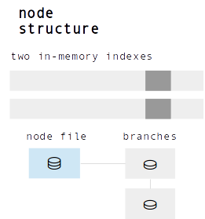
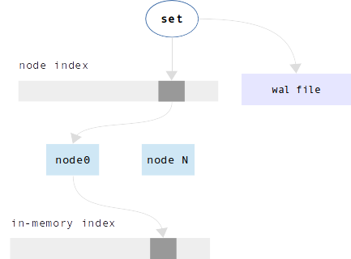
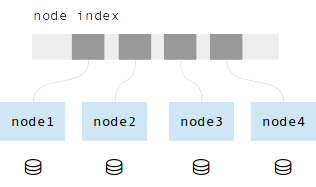

.. _sophia:

-------------------------------------------------------------------------------
                        Appendix E. Sophia
-------------------------------------------------------------------------------

==================================
           Introduction
==================================

Sophia's features are:

* Full ACID compliance
* Multi-Version Concurrency Control (MVCC)
* Pure Append-Only
* Multi-threaded (Client access and Engine scalability)
* Multi-databases support (Single environment and WAL)
* Multi-Statement and Single-Statement Transactions (Snapshot Isolation (SI), multi-databases)
* Asynchronous or synchronous transaction execution (Callback triggered versus blocking)
* Separate storage formats: key-value (Default), or document (Keys are part of value)
* Update without read
* Consistent Cursors
* Prefix search
* Point-in-Time Snapshots
* Versional database creation and asynchronous shutdown/drop
* Asynchronous Online/Hot Backup
* Compression (Per region, both lz4 and zstd are supported)
* Metadata Compression (By default)
* Key Compression (Compress key duplicates, including suffixes)
* Easy to use (Minimalist API)
* Easy to integrate (Native support of using as storage engine)
* Easy to write bindings (Very FFI-friendly, API designed to be stable in future)
* Easy to build in (Amalgamated, compiles into two C files)
* Event loop friendly
* Zero-Configuration (Tuned by default)
* Implemented as a small library **written in C** with zero dependencies
* BSD Licensed

It is appropriate for databases that cannot fit in memory, where access via secondary keys is not required.

In sophia terminology:

* There is one **Environment**.
* An Environment has N **Databases** - a sophia database is like a Tarantool `space`.
* A Database has N **Nodes**.
* A Node has one **Node File**.
* A Node File has N **Branches**.
* A Branch has N **Regions** - a sophia Region is like a B-tree `page`.
* A Region has **keys** and **values** - a sophia key-value is like a Tarantool `tuple`.

A key and its associated value are together, so when one accesses a key one gets
the whole tuple. In other words, in sophia the data is stored in the index. There
are up to two in-memory copies of an index, as well as the copy in the Node File.

For operations that insert or update tuples - called Set operations in sophia -
sophia makes changes to in-memory copies of the index, and writes to Tarantool's
Write-ahead Log. A scheduler assigns tasks to multiple background threads for
transferring index data from memory to disk, and for reorganizing Branches. To
support transactions, Set operations can be delayed until an explicit commit. If
multiple users access the same tuples simultaneously, the concurrency control
method is `MVCC`_ and the isolation level is `Snapshot`_.

.. _MVCC: https://en.wikipedia.org/wiki/Multiversion_concurrency_control
.. _Snapshot: https://en.wikipedia.org/wiki/Snapshot_isolation

Formally, in terms of disk accesses, sophia has the following algorithmic complexity:

* **Set** - the worst case is O(*1*) append-only key writes to the Write-Ahead
  Log + in-memory node index searches + in-memory index inserts
* **Delete** - the worst case is O(*1*) key writes and in-memory index inserts
  (the same as **Set**)
* **Get** - the worst case is `amortized`_ O(*max\_branch\_count\_per\_node*)
  random Region reads from a single node file, which itself does in-memory index
  search + in-memory Region search
* **Range** - queries, the worst case of full Database scan is amortized
  O(*total\_Region\_count*) + in-memory key-index searches for each Node

.. _amortized: https://en.wikipedia.org/wiki/Amortized_analysis

===========================================================
                    Under the hood
===========================================================

In this section, to illustrate internals, we will discuss this example:

1. filling an empty database with one million tuples (we'll call them "keys" to
   emphasize the indexed nature)
2. reading all stored tuples in the original order.

~~~~~~~~~~~~~~~~~~~~~~~~~~~~~~~~~~
 Inserting the first 200.000 keys
~~~~~~~~~~~~~~~~~~~~~~~~~~~~~~~~~~

During the first 200,000 Set operations, inserted keys first go to the
in-memory index. To maintain persistence, information about each Set
operation is written to Tarantool's Write-ahead Log.

.. image:: i1.png
    :align: center
    :alt: i1.png

At this point we have keys in an in-memory index
and records in the Write-ahead Log.

~~~~~~~~~~~~~~~~~~~~~~~~~~~~~~~~~~~
  Inserting the next 300.000 keys
~~~~~~~~~~~~~~~~~~~~~~~~~~~~~~~~~~~

As the in-memory index becomes too large for available memory, the index must be
copied from memory to disk. The on-disk copy of the in-memory index is called a
Branch. To save the Branch, a new file is created, the Node File. We will call
it **db file** for this example.

The scheduler wakes a worker thread in the background, a Branch Creation Thread.
The thread creates a second in-memory index. If there are Set operations taking
place while the thread is working, their contention effect will be small because
they will operate on the second in-memory index.

.. image:: i2.png
    :align: center
    :alt: i2.png

When the Branch Creation Thread finishes the task, the first in-memory index is
freed.

.. image:: i3.png
    :align: center
    :alt: i3.png

~~~~~~~~~~~~~~~~~~~~~~~~~~~~~~~~~~~
  Inserting the next 200.000 keys
~~~~~~~~~~~~~~~~~~~~~~~~~~~~~~~~~~~

Several times, the in-memory index becomes too large and a Branch Creation
Thread transfers the keys to a Branch. The Branches have been appended to the
end of db file. The number of created Branches becomes large.

.. image:: i4.png
    :align: center
    :alt: i4.png

There is a user-settable maximum number of Branches per Node. When the number of
Branches reaches this maximum, the sophia scheduler wakes a **Compaction Thread**
for the db file. The Compaction Thread merges the keys in all the Branches, and
creates one or more new db files.

.. image:: i5.png
    :align: center
    :alt: i5.png

Now there are multiple pairs of in-memory indexes, and each pair has an
associated db file. The combination of the in-memory indexes and the db file is
called a **Node**, and the db file is called a **Node File**.

Thus the contents of a Node are: a range of sorted key values, stored in Branches
of a Node File and (when necessary) in memory. Since the ranges do not overlap,
each Node can be handled independently. Therefore, while one of the background
threads is working on Node 1, another background thread can be working on Node 2,
without contention. That means that all the background operations (Branch Creation,
Compaction, Garbage Collection, and Backup) can take place in parallel on multiple
threads.

The foregoing explanation will now be repeated with different wording.

Before the Compaction there was one Node, which was created automatically when
the Database was initialized. The Node had:

a. an in-memory index with some keys in it,
b. a Node File with several Branches,
c. a Write-Ahead Log file recording the Set operations, in the order they happened.

The number of branches became too big, so the sophia scheduler starts the
Compaction Thread and creates two new Nodes.

.. image:: i7.png
    :align: center
    :alt: i7.png

So, each of the two new Node Files contains half of the keys that were in the
original Node. The Node's in-memory indexes are split in the same way.

After the splitting, sophia must take into account that: while the Compaction
was going on in the background, there might have been more Set operations taking
place in parallel. These Set operations would have changed one of the in-memory
indexes, and these changes too will be merged.

When the Compaction Thread finishes, the original Node is deleted, and
information about the new Nodes is inserted into an in-memory **Node Index**.

.. image:: i8.png
    :align: center
    :alt: i8.png

This Node Index is used for all Set operations and all searches. Since the Node
Index has the minimum and maximum key values that are in each Node, it is
straightforward to scan it to find what Node would contain a particular key value.

~~~~~~~~~~~~~~~~~~~~~~~~~~~~~~~~~~~
  Inserting the last 300.000 keys
~~~~~~~~~~~~~~~~~~~~~~~~~~~~~~~~~~~

The final 300,000 Set operations take place; the background threads continue to
create new Branches and do more Compactions. After the millionth insertion, the
Database has four Nodes.

The inserting is done. Now, because the words "memory" and "disk" have appeared
in this explanation several times, here are a few words about how sophia is
designed to use these resources most efficiently:

* If there is more memory available, then Branch Creation and Compaction will be
  less frequent, and there will be fewer disk accesses.
* The best sophia performance will occur if there is no setting of a memory limit,
  but this must be balanced against other considerations, such as requirements
  for the memtx storage engine. If there is a setting of a memory limit, the
  sophia scheduler will give priority to the Nodes that have the largest
  in-memory indexes, so that the largest memory blocks are freed first.
* To make the most of hard drives and Flash, sophia will delay operations that
  require disk access (except the writing of the Write-ahead Log which is
  specially tunable), so that the accesses are done in large sequential blocks.
* Overwriting does not occur; sophia is an "append-only" engine.

~~~~~~~~~~~~~~~~~~~~~~~~~~~~~~~~~~~
       Reading million keys
~~~~~~~~~~~~~~~~~~~~~~~~~~~~~~~~~~~

We will now start to read the million rows in the order that they were inserted,
which was random.

.. image:: i12.png
    :align: center
    :alt: i12.png

During the Get (search), sophia first finds the correct Node by looking in the
Node Index. Then it searches the Node's first in-memory index, and/or the Node's
second in-memory index, and/or each Branch of the Node, starting from the end of
the Node File.

Remember that a Branch is divided into Regions, which are like what would be
called "pages" or "blocks" in a B-tree. For each Branch, there is a list of the
Regions and their minimum/maximum key values - the Region Index - as well as
some metadata.

.. image:: i13.png
    :align: center
    :alt: i13.png

Region Indexes are loaded into memory when the Database is opened. Since the
Database's Node Index and the Region Indexes are normally in-memory, searching
and retrieving a tuple might require only zero or one disk accesses. However,
when memory is limited and there are many Branches, search time may rise.
For each additional Branch there is a possible additional disk access during a
search. Also, it is impossible to maintain memory limits without doing a Branch
Creation process, because new Set operations might occur more quickly than the
Compaction process can run.

.. image:: i14.png
    :align: center
    :alt: i14.png

Sophia is read optimized. It is very likely that the most recently created
Branches (hot data) will be in the file system cache. The scheduler will give
priority to the Nodes which have the largest in-memory indexes and the most
Branches.

The scheduler may also try to arrange that a Node will have only one Branch,
which will ensure the average number of disk seeks for each search is O(*1*).
