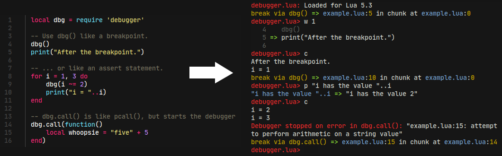

luadebug.lua
=

A simple debugging console for the Tarantool.




luadebug.lua is a simple, single file, pure Lua debugger that is easy to integrate with any project. The lua-users wiki lists a [number of debuggers](http://lua-users.org/wiki/DebuggingLuaCode). clidebugger was closest to what I was looking for, but I ran into several compatibility issues, and the rest are pretty big libraries with a whole lot of dependencies. I just wanted something simple to integrate that would work through stdin/stdout. I also decided that it sounded fun to try and make my own!

Features
-

- Trivial to "install". Can be integrated as a single .lua _or_ .c file.
- The regular assortment of commands you'd expect from a debugger: continue, step, next, finish, print/eval expression, move up/down the stack, backtrace, print locals, inline help.
- Evaluate expressions, call functions interactively, and get/set variables.
- Pretty printed output so you see `{1 = 3, "a" = 5}` instead of `table: 0x10010cfa0`
- Speed! The debugger hooks are only set during the step/next/finish commands.
- Conditional, assert-style breakpoints.
- Colored output and line editing support when possible.
- Drop in replacements for Lua's `assert()`, `error()`, and `pcall()` functions that trigger the debugger.
- When using the C API, `dbg_call()` works as a drop-in replacement for `lua_pcall()`.
- IO can easily be remapped to a socket or window by overwriting the `dbg.write()` and `dbg.read()` functions.
- Permissive MIT license.

Easy to use from C too!
-

luadebug.lua can be easily integrated into an embedded project with just a .c and .h file. First though, you'll need to run `lua embed/debugger.c.lua`. This generates embed/debugger.c by inserting the lua code into a template .c file.

```c
int main(int argc, char **argv){
	lua_State *lua = luaL_newstate();
	luaL_openlibs(lua);

	// The 2nd parameter is the module name. (Ex: require("debugger") )
	// The 3rd parameter is the name of a global variable to bind it to, or NULL if you don't want one.
	// The last two are lua_CFunctions for overriding the I/O functions.
	// A NULL I/O function  means to use standard input or output respectively.
	dbg_setup(lua, "debugger", "dbg", NULL, NULL);

	// Load some lua code and prepare to call the MyBuggyFunction() defined below...

	// dbg_pcall() is called exactly like lua_pcall().
	// Although note that using a custom message handler disables the debugger.
	if(dbg_pcall(lua, nargs, nresults, 0)){
		fprintf(stderr, "Lua Error: %s\n", lua_tostring(lua, -1));
	}
}
```

Now in your Lua code you can just use the global variable or `require` the module name you passed to the `dbg_setup()` call.

Debugger Commands:
-

If you have used other CLI debuggers, luadebug.lua shouldn't be surprising.
Majority of commands are single letters, but you could also use their full-name
aliases.

| Commands/Aliases | Description |
|------------------|-------------|
| `b`, `break`, `breakpoint`, `add_break`, `add_breakpoint location` | Set new breakpoints at `module.lua+num` |
| `bd`, `bdelete`, `delete_break`, `delete_breakpoint location` | Delete breakpoint |
| `bl`, `blist`, `list_break`, `list_breakpoints` | List breakpoints |
| `c`, `cont`, `continue` | Continue execution |
| `d`, `down` | Move down the stack by one frame |
| `e`, `eval $expression` | Execute the statement |
| `f`, `finish`, `step_out` | Step forward until exiting the current function |
| `h`, `help`, `?` | Print help message |
| `l`, `locals` | Print the function arguments, locals and upvalues |
| `n`, `next`, `step_over` | Step forward by one line (skipping over functions) |
| `p`, `print $expression` | Execute the expression and print the result |
| `q`, `quit` | Exit debugger |
| `s`, `st`, `step`, `step_into` | Step forward by one line (into functions) |
| `t`, `trace`, `bt` | Print the stack trace |
| `u`, `up` | Move up the stack by one frame |
| `w`, `where linecount` | Print source code around the current line |

For example, for breakpoint addition you could either use single-letter command
`b`, or their aliases `breakpoint`, `add_break`. You could step over current
line of code using simple `n` or it's alias `next`. You could navigate one stack
frame above using `u`, or `up` as alias. And so on.

Breakpoints
-

One could set breakpoint either using full syntax `filename:linenumber` as:

  break debug-target.lua:9

Or using "short" syntax using only line numbers in a form `+NN` or `:NN`. In this
case debugger will use current active script file as a base for such breakpoint.

  b +9

Both those syntaxes mentioned above are equivalent and should behave identically.

If breakpoint(s) saved, then execution (command 'continue') will be slowed down a
bit by calling to a debugger line hook for each executed line. If there is no any
breakpoint activated then execution (via `continue`) will be at the speed near to
native, without any visible slowdown.

You could see all activated breakpoints via `bl` command:

  blist

Saved breakpoint could be deactivated via `bd` command:

  bdelete +9

If you need to remove all breakpoints and continue execution at full speed
then there is special breakpoint location name `*` that could be used:

  bd *

Debugger API
-

There are several overloadable functions you can use to customize luadebug.lua.
* `dbg.read(prompt)` - Show the prompt and block for user input. (Defaults to read from stdin)
* `dbg.write(str)` - Write a string to the output. (Defaults to write to stdout)
* `dbg.shorten_path(path)` - Return a shortened version of a path. (Defaults to simply return `path`)
* `dbg.exit(err)` - Stop debugging. (Defaults to `os.exit(err)`)

Using these you can customize the debugger to work in your environment. For instance, you can divert the I/O over a network socket or to a GUI window.

There are also some goodies you can use to make debugging easier.
* `dbg.writeln(format, ...)` - Basically the same as `dbg.write(string.format(format.."\n", ...))`
* `dbg.cfg.pretty_depth = int` - Set how deep `dbg.pretty()` formats tables.
* `dbg.pretty(obj)` - Will return a pretty print string of an object.
* `dbg.pp(obj)` - Basically the same as `dbg.writeln(dbg.pretty(obj))`
* `dbg.cfg.auto_where = int_or_false` - Set the where command to run automatically when the active line changes. The value is the number of context lines.
* `dbg.error(error, [level])` - Drop in replacement for `error()` that breaks in the debugger.
* `dbg.assert(error, [message])` - Drop in replacement for `assert()` that breaks in the debugger.
* `dbg.call(f, ...)` - Drop in replacement for `pcall()` that breaks in the debugger.

Environment Variables:
-

Want to disable ANSI color support or disable GNU readline? Set the `NO_COLOR`.

Known Issues:
-

- Debugger REPL is not yet compatible with Tarantool console, i.e. this
  code will hang in terminal

```lua
tarantool> dbg = require 'luadebug'
tarantool> dbg()
```
  One should call debugger activation only in their instrumented code, not
  from interactive console.

- Lua 5.1 lacks the API to access varargs. The workaround is to do something like `local args = {...}` and then use `unpack(args)` when you want to access them. In Lua 5.2+ and LuaJIT, you can simply use `...` in your expressions with the print command.
- You can't add breakpoints to a running program or remove them. Currently the only way to set them is by explicitly calling the `dbg()` function explicitly in your code. (This is sort of by design and sort of because it's difficult/slow otherwise.)
- Different interpreters (and versions) print out slightly different stack trace information.
- Tail calls are handled silghtly differently in different interpreters. You may find that 1.) stepping into a function that does nothing but a tail call steps you into the tail called function. 2.) The interpreter gives you the wrong name of a tail called function (watch the line numbers). 3.) Stepping out of a tail called function also steps out of the function that performed the tail call. Mostly this is never a problem, but it is a little confusing if you don't know what is going on.
- Coroutine support has not been tested extensively yet, and Lua vs. LuaJIT handle them differently anyway. -_-

License:
-

	Copyright (c) 2021 Scott Lembcke and Howling Moon Software
	
	Permission is hereby granted, free of charge, to any person obtaining a copy
	of this software and associated documentation files (the "Software"), to deal
	in the Software without restriction, including without limitation the rights
	to use, copy, modify, merge, publish, distribute, sublicense, and/or sell
	copies of the Software, and to permit persons to whom the Software is
	furnished to do so, subject to the following conditions:
	
	The above copyright notice and this permission notice shall be included in
	all copies or substantial portions of the Software.
	
	THE SOFTWARE IS PROVIDED "AS IS", WITHOUT WARRANTY OF ANY KIND, EXPRESS OR
	IMPLIED, INCLUDING BUT NOT LIMITED TO THE WARRANTIES OF MERCHANTABILITY,
	FITNESS FOR A PARTICULAR PURPOSE AND NONINFRINGEMENT. IN NO EVENT SHALL THE
	AUTHORS OR COPYRIGHT HOLDERS BE LIABLE FOR ANY CLAIM, DAMAGES OR OTHER
	LIABILITY, WHETHER IN AN ACTION OF CONTRACT, TORT OR OTHERWISE, ARISING FROM,
	OUT OF OR IN CONNECTION WITH THE SOFTWARE OR THE USE OR OTHER DEALINGS IN THE
	SOFTWARE.
